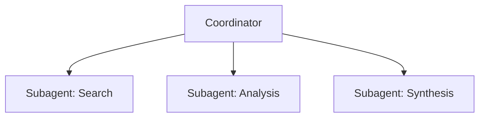
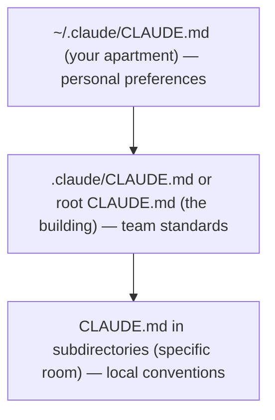
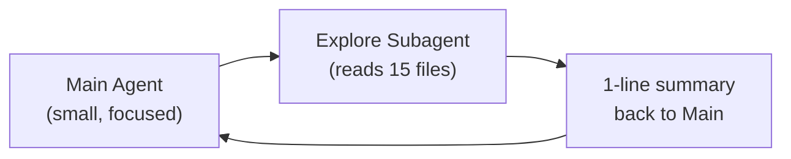

# Claude Certified Architect — Foundations Certification

## A Friendly Study Companion (Plain English Edition)

> This is the friendlier sibling of the official `guide_en.MD`. Same exam material, same code, same questions — but the explanations swap dense paragraphs for plain English and real-world analogies you can actually remember on exam day.
>
> The 12 example questions, the 76-question practice test, the practical exercises, and the appendix are reproduced verbatim further down. The exam vocabulary (`stop_reason`, `tool_use`, `AgentDefinition`, `PostToolUse`, `Task`, `fork_session`, `tool_choice`, `isError`, `--print`, `custom_id`, `.claude/rules/`, `Message Batches`, etc.) is preserved 1:1.

---

## What This Cert Actually Tests

The Claude Certified Architect — Foundations exam is basically asking: *"Can you make sane trade-off decisions when you ship something real on top of Claude?"* It is not asking you to recite docs. It is asking whether, when something breaks at 2 AM, you can pick the fix that addresses the root cause instead of the fix that "feels right."

The four pillars you'll be tested on:

- **Claude Code** — the IDE-flavored Claude that lives in your repo
- **Claude Agent SDK** — the toolkit for building agents that loop, delegate, and call tools
- **Claude API** — the direct request/response interface
- **Model Context Protocol (MCP)** — the standard way to plug external systems into Claude

The exam questions come from realistic industry scenarios: customer support agents, multi-agent research pipelines, Claude Code in CI/CD, developer productivity tools, structured data extraction. If you've shipped at least one of those on Claude, you're the target audience.

---

## Who You Are (or Should Be)

The exam is aimed at **solution architects** with at least 6 months of hands-on Claude work. Concretely, you should be comfortable with:

- **Claude Agent SDK** — orchestrating multiple agents, handing work off to subagents, wiring up tools, lifecycle hooks
- **Claude Code** — CLAUDE.md, MCP servers, Agent Skills, planning mode
- **Model Context Protocol (MCP)** — exposing tools and resources from your backend
- **Prompt engineering** — JSON schemas, few-shot examples, data-extraction templates
- **Context windows** — long documents, multi-agent context handoff
- **CI/CD pipelines** — automated code review, test generation
- **Escalation and reliability** — error handling, human-in-the-loop

If a few of these feel hand-wavy right now, this guide will fix that.

---

## Exam Format at a Glance

| Parameter | Value |
|---|---|
| Question type | Multiple choice (1 correct out of 4) |
| Scoring | 100–1000 scale, passing score **720** |
| Guessing penalty | None — answer every question |
| Scenarios | 4 out of 8 possible (randomly selected) |

**Read the questions like a lawyer.** Every "best", "most effective", "first step", or "root cause" is a hint. The exam loves trade-off questions where two answers technically work but only one fixes the *cause*. Pick the cause.

---

## The Five Domains and What They're Worth

| Domain | Weight |
|---|---|
| 1. Agent architecture and orchestration | **27%** |
| 2. Tool design and MCP integration | **18%** |
| 3. Claude Code configuration and workflows | **20%** |
| 4. Prompt engineering and structured output | **20%** |
| 5. Context management and reliability | **15%** |

Domain 1 is the heaviest. Don't skim it.

---

## The 8 Possible Exam Scenarios

The real exam picks 4 of these at random. Here's a quick "what does this world look like?" for each.

### Scenario 1: Customer Support Agent
You're building an agent that handles returns, billing disputes, and account issues using the Claude Agent SDK. It uses MCP tools (`get_customer`, `lookup_order`, `process_refund`, `escalate_to_human`). The dream is 80%+ first-contact resolution and clean escalation when the agent should step aside.

### Scenario 2: Code Generation with Claude Code
You're using Claude Code to speed up development — writing code, refactoring, debugging, generating docs. You need to know how custom slash commands, CLAUDE.md configuration, and planning mode all fit together.

### Scenario 3: Multi-Agent Research System
A coordinator agent delegates to specialist subagents: web research, document analysis, synthesis, report generation. The system has to produce complete reports with citations.

### Scenario 4: Developer Productivity Tools
The agent helps engineers explore an unfamiliar codebase, generate boilerplate, and automate routine work. Built-in tools (Read, Write, Bash, Grep, Glob) plus MCP servers do the heavy lifting.

### Scenario 5: Claude Code for Continuous Integration
Drop Claude Code into a CI/CD pipeline for automated reviews, test generation, and PR feedback — without flooding the team with false positives.

### Scenario 6: Structured Data Extraction
Pull structured data out of unstructured documents, validate it against JSON schemas, and keep accuracy high — even on messy edge cases.

### Scenario 7: Conversational AI Architecture Patterns
Multi-turn conversations: managing the context window, keeping instructions intact across many turns, deciding what memory to persist, designing tools that can't blow up if Claude does something unexpected, and gracefully handling ambiguous or contradictory user input.

### Scenario 8: Agentic AI Tools *(content missing — help us fill it in!)*
Reported by candidates but not yet covered in this guide. If you sit the exam and recall any questions, share them in [GitHub Issues](https://github.com/paullarionov/claude-certified-architect/issues).

---

# Official Documentation

| Resource | URL |
|---|---|
| **Claude API — Messages** | https://platform.claude.com/docs/en/api/messages |
| **Claude API — Tool Use** | https://platform.claude.com/docs/en/build-with-claude/tool-use |
| **Claude API — Message Batches** | https://platform.claude.com/docs/en/build-with-claude/message-batches |
| **Claude Agent SDK — Overview** | https://platform.claude.com/docs/en/agent-sdk/overview |
| **Claude Agent SDK — Hooks** | https://platform.claude.com/docs/en/agent-sdk/hooks |
| **Claude Agent SDK — Subagents** | https://platform.claude.com/docs/en/agent-sdk/subagents |
| **Claude Agent SDK — Sessions** | https://platform.claude.com/docs/en/agent-sdk/sessions |
| **Model Context Protocol (MCP)** | https://modelcontextprotocol.io/ |
| **MCP — Tools** | https://modelcontextprotocol.io/docs/concepts/tools |
| **MCP — Resources** | https://modelcontextprotocol.io/docs/concepts/resources |
| **MCP — Servers** | https://modelcontextprotocol.io/docs/concepts/servers |
| **Claude Code — Documentation** | https://code.claude.com/docs/en/overview |
| **Claude Code — CLAUDE.md and Memory** | https://code.claude.com/docs/en/memory |
| **Claude Code — Skills (incl. slash commands)** | https://code.claude.com/docs/en/skills |
| **Claude Code — Hooks** | https://code.claude.com/docs/en/hooks |
| **Claude Code — Sub-agents** | https://code.claude.com/docs/en/sub-agents |
| **Claude Code — MCP Integration** | https://code.claude.com/docs/en/mcp |
| **Claude Code — GitHub Actions CI/CD** | https://code.claude.com/docs/en/github-actions |
| **Claude Code — GitLab CI/CD** | https://code.claude.com/docs/en/gitlab-ci-cd |
| **Claude Code — Headless (non-interactive mode)** | https://code.claude.com/docs/en/headless |
| **Prompt Engineering Guide** | https://platform.claude.com/docs/en/build-with-claude/prompt-engineering/overview |
| **Extended Thinking** | https://platform.claude.com/docs/en/build-with-claude/extended-thinking |
| **Anthropic Cookbook (code examples)** | https://github.com/anthropics/anthropic-cookbook |

---

# PART I: THEORY FOUNDATIONS

This is the meaty section. It's organized by *technology*, not by exam domain — that gives you a deeper mental model. The exam questions then become much easier because you'll recognize the pattern, not just the keyword.

---

# Chapter 1: Claude API — Talking to the Model

> Documentation: [Messages API](https://platform.claude.com/docs/en/api/messages) | [Prompt Engineering](https://platform.claude.com/docs/en/build-with-claude/prompt-engineering/overview)

**The mental model:** Claude is a brilliant chef working at a restaurant that takes orders only by mail. There's no waiter, no table, and *no memory*. Every time you want another course, you mail the chef a fresh letter that includes the entire dinner order so far. That's the Claude API.

## 1.1 API Request Structure

Every request to the Claude Messages API looks something like this:

```json
{
  "model": "claude-sonnet-4-6",
  "max_tokens": 1024,
  "system": "You are a helpful assistant.",
  "messages": [
    {"role": "user", "content": "Hi!"},
    {"role": "assistant", "content": "Hello!"},
    {"role": "user", "content": "How are you?"}
  ],
  "tools": [...],
  "tool_choice": {"type": "auto"}
}
```

The fields, translated:
- `model` — which model is on shift today (`claude-opus-4-6`, `claude-sonnet-4-6`, `claude-haiku-4-5`)
- `max_tokens` — how long the reply is allowed to be
- `system` — the standing instructions ("you are a customer support agent")
- `messages` — **the entire dinner order so far**. You must resend the whole history every time
- `tools` — the menu of "power tools" Claude is allowed to call
- `tool_choice` — whether Claude is free to pick a tool, must pick any tool, or is forced to pick a specific one

**Remember for the exam:** Claude is stateless. No memory between requests. Forget that and you've already failed half the conversational-AI questions.

## 1.2 Message Roles

Three roles show up in the `messages` array:

- `user` — what the user said
- `assistant` — what Claude said previously (you include this when you replay history)
- `tool` — the result of a tool call (technically appears as a `tool_result` content block; the role isn't literally set to `"tool"`)

**Critical:** every API call sends the *full* conversation history. The model is amnesiac between calls — your application is the one keeping the memory.

## 1.3 The `stop_reason` Field

When Claude finishes generating, it tells you *why* it stopped. This is the loop signal you live and die by:

| Value | Meaning | What you should do |
|---|---|---|
| `"end_turn"` | Done | Show the result to the user |
| `"tool_use"` | Wants to call a tool | Run the tool, append the result to history, call Claude again |
| `"max_tokens"` | Ran out of room | Response is truncated; bump the limit if needed |
| `"stop_sequence"` | Hit a stop sequence you defined | Handle per your app logic |

For agents, the only two values that matter are `"tool_use"` and `"end_turn"`. They are the engine of the loop.

**Remember for the exam:** never parse Claude's text to detect "I'm done." Trust `stop_reason`. The exam will absolutely punish you for "looking at the words" instead.

## 1.4 System Prompt

Think of the system prompt as the standing instructions you give a contractor before they start work. They apply to the whole job and override casual side comments.

A few things to know:
- It lives in the `system` field, not in `messages`
- It outranks user messages
- It's loaded once and applies for the whole conversation
- Best place to define role, tone, constraints, and output format

**Sneaky exam trap:** the wording of the system prompt can accidentally bias tool selection. An instruction like "always verify the customer first" can cause overuse of `get_customer` even when it's not needed. The system prompt is powerful — and powerful means easy to misuse.

## 1.5 Context Window — The Whiteboard

The context window is everything Claude sees in one shot: the system prompt, the entire message history, the tool definitions, *and* the tool results. It's a finite whiteboard.

Three things go wrong if you ignore it:

1. **Lost-in-the-middle.** Claude reads the start and the end of long inputs reliably; the middle gets fuzzy. Like a long meeting where you remember the opening and the conclusion but not the slide on Q3 KPIs. **Mitigation:** put critical info near the top or the bottom.

2. **Tool result bloat.** A `lookup_order` that returns 40+ fields when you needed 5 wastes most of the whiteboard on noise.

3. **Progressive summarization rot.** When older history gets compressed, exact numbers, percentages, and dates degrade into "about", "roughly", "a few." Bad if those numbers were the whole point.

**Remember for the exam:** when an agent forgot the discount you discussed 20 turns ago, the answer almost always involves *extracting facts into a separate persistent block* outside the summarized history.

---

# Chapter 2: Tools and `tool_use` — Giving Claude a Workshop

> Documentation: [Tool Use](https://platform.claude.com/docs/en/build-with-claude/tool-use)

**The mental model:** tools are the power tools in a workshop. Claude looks at the job, *writes the work order*, and your code is the one that actually picks up the saw and cuts the wood. Claude never runs anything itself.

## 2.1 What Is `tool_use`

`tool_use` is the mechanism that lets Claude call external functions. Claude doesn't execute code — it produces a structured request describing the call. Your code runs the function and feeds the result back.

## 2.2 Tool Definition

Each tool has a JSON-schema definition:

```json
{
  "name": "get_customer",
  "description": "Finds a customer by email or ID. Returns the customer profile, including name, email, order history, and account status. Use this tool BEFORE lookup_order to verify the customer's identity. Accepts an email (format: user@domain.com) or a numeric customer_id.",
  "input_schema": {
    "type": "object",
    "properties": {
      "email": {"type": "string", "description": "Customer email"},
      "customer_id": {"type": "integer", "description": "Numeric customer ID"}
    },
    "required": []
  }
}
```

Things that matter (a lot):

1. **The description is the menu.** Claude picks tools the way you pick a dish — by reading the description. A bare description like "Retrieves customer information" is the equivalent of a menu that just says "soup." You will get the wrong order.

2. **A good description includes:**
   - What the tool does and what it returns
   - Input formats and example values
   - Edge cases and constraints
   - When to use *this* tool versus a similar-looking one

3. **Avoid lookalike descriptions.** If `analyze_content` and `analyze_document` say roughly the same thing, Claude will mix them up. Rename or rewrite until each one stands out.

4. **Built-in vs MCP tools.** Claude often prefers built-in tools (Read, Grep) over MCP equivalents. If you want your MCP tool used, write a description that explicitly calls out what it offers that built-ins can't.

**Remember for the exam:** when an agent picks the wrong tool, the *first* thing to fix is almost always tool descriptions. Not the prompt. Not a router. Not a classifier.

## 2.3 The `tool_choice` Parameter

`tool_choice` tells Claude how much freedom it has when picking tools:

| Value | Behavior | When to use |
|---|---|---|
| `{"type": "auto"}` | Claude decides whether to call a tool or just answer in text | Default for most things |
| `{"type": "any"}` | Claude **must** call some tool (any one) | When you require structured output |
| `{"type": "tool", "name": "extract_metadata"}` | Claude **must** call this exact tool | When you need a guaranteed first step or order |

Useful patterns:

- `tool_choice: "any"` + multiple extraction tools → Claude picks the best fit, but you're guaranteed structured output
- Forced selection → great when the first step must always be the same (e.g., `extract_metadata` before any enrichment)

## 2.4 JSON Schemas for Structured Output

Pairing `tool_use` with a JSON Schema is the **most reliable** way to get structured output from Claude. Think of the schema as a form with labeled boxes — Claude has to fill in each box, and the form refuses to accept missing braces or wrong field types.

What the schema gives you:

- **Syntactically valid JSON** — no missing braces, no trailing commas, correct types
- **Required structure** — required fields are present
- It does **not** guarantee semantic correctness — values can still be wrong

Example schema:

```json
{
  "type": "object",
  "properties": {
    "category": {
      "type": "string",
      "enum": ["bug", "feature", "docs", "unclear", "other"]
    },
    "category_detail": {
      "type": ["string", "null"],
      "description": "Details if category = 'other' or 'unclear'"
    },
    "severity": {
      "type": "string",
      "enum": ["critical", "high", "medium", "low"]
    },
    "confidence": {
      "type": "number",
      "minimum": 0,
      "maximum": 1
    },
    "optional_field": {
      "type": ["string", "null"],
      "description": "Null if the information was not found in the source"
    }
  },
  "required": ["category", "severity"]
}
```

Schema design rules of thumb:

1. **Be picky about `required`.** Only mark a field required if the information is *always* available. Required fields force Claude to invent values when data is missing.
2. **Use nullable types** (`"type": ["string", "null"]`) for fields that may be absent. Null is honest. Hallucination is not.
3. **Add `"other"` to enums** plus a `category_detail` string so Claude can route unexpected categories without losing the data.
4. **Add `"unclear"` to enums** when "I don't know" is a legitimate answer — better than forcing a wrong category.

**Remember for the exam:** `tool_use` + JSON Schema kills *syntax* errors, not *semantic* errors. The exam loves to test that distinction.

## 2.5 Syntax vs Semantic Errors

| Type | Example | Mitigation |
|---|---|---|
| **Syntax** | Invalid JSON, wrong field type | `tool_use` with a JSON schema (eliminates) |
| **Semantic** | Totals don't add up, value in the wrong field, hallucination | Validation checks, retry with feedback, self-correction |

Two completely different problems, two completely different fixes. The exam will mix and match these in nasty ways.

---

# Chapter 3: Claude Agent SDK — Building Things That Loop

> Documentation: [Agent SDK](https://platform.claude.com/docs/en/agent-sdk/overview) | [Hooks](https://platform.claude.com/docs/en/agent-sdk/hooks) | [Subagents](https://platform.claude.com/docs/en/agent-sdk/subagents) | [Sessions](https://platform.claude.com/docs/en/agent-sdk/sessions)

**The mental model:** an agent is a chef following a recipe — cook a step, taste it, decide what's next, repeat until plated. A *multi-agent* system is a project manager (the coordinator) handing pieces of work to specialists (the subagents). The PM doesn't cook. The PM coordinates.

## 3.1 The Agentic Loop

The agentic loop is the heartbeat of any agent. Claude doesn't just answer — it acts:

```
1. Send a request to Claude with tools
2. Receive a response
3. Check stop_reason:
   - "tool_use" -> execute the tool, append the result to history, go back to step 1
   - "end_turn" -> task is complete, show the result to the user
4. Repeat until completion
```

This is **model-driven** decision making. Claude picks the next tool based on context and previous results. That's very different from a hard-coded decision tree where you've prewritten every path.

**Anti-patterns to avoid (the exam will dangle these):**

- Parsing the assistant's text for "Task completed" or similar
- Using an arbitrary `max_iterations=5` as the *primary* stop condition
- Treating the presence of textual content as a completion signal

**The only reliable completion signal is `stop_reason == "end_turn"`.** Tattoo it on your hand.

## 3.2 `AgentDefinition` Configuration

`AgentDefinition` is how you configure an agent in the Agent SDK:

```python
agent = AgentDefinition(
    name="customer_support",
    description="Handles customer requests for returns and order issues",
    system_prompt="You are a customer support agent...",
    allowed_tools=["get_customer", "lookup_order", "process_refund", "escalate_to_human"],
    # For a coordinator:
    # allowed_tools=["Task", "get_customer", ...]
)
```

Key parameters:

- `name` / `description` — identification
- `system_prompt` — the standing instructions
- `allowed_tools` — *only* the tools this agent is allowed to touch (principle of least privilege)

**Pro tip for the exam:** if an agent is misusing a general tool, the right fix is often to **swap the general tool for a constrained one** (e.g., `fetch_url` → `load_document`), not to add prompt instructions begging it to behave.

## 3.3 Hub-and-Spoke: Coordinator and Subagents

Multi-agent systems use a hub-and-spoke (a.k.a. star) topology. Picture an airline hub:



The coordinator's job:

- Decompose the task into subtasks
- Decide which subagents are needed (dynamically)
- Delegate work
- Aggregate and validate results
- Handle errors and retries
- Talk to the user

**Critical principle: subagents have isolated context.** This catches many people on the exam:

- Subagents do **not** automatically inherit the coordinator's history
- Required context must be **explicitly passed** in the subagent prompt
- Subagents don't share memory across calls
- All communication flows through the coordinator (for observability and consistent error handling)

Think of giving a freelancer a folder of materials versus letting them rummage through your entire inbox. Folders only.

## 3.4 The `Task` Tool — How You Spawn Subagents

You spawn subagents through the `Task` tool. The coordinator's `allowed_tools` must include `"Task"`:

```python
# The coordinator's allowedTools must include "Task"
coordinator_agent = AgentDefinition(
    allowed_tools=["Task", "get_customer"]
)
```

**You must pass context explicitly:**

```
# Bad: the subagent has no context
Task: "Analyze the document"

# Good: full context in the prompt
Task: "Analyze the following document.
Document: [full document text]
Prior search results: [web search results]
Output format requirements: [schema]"
```

**Parallel spawning** is real — a coordinator can call multiple `Task`s in one response and the subagents run concurrently:

```
# One coordinator response contains:
Task 1: "Search for articles about X"
Task 2: "Analyze document Y"
Task 3: "Search for articles about Z"
# All three run in parallel
```

## 3.5 Hooks — Airport Security for Tool Calls

Hooks let you intercept and transform things at specific points in the agent lifecycle. The big mental leap: **hooks give you a deterministic guarantee. Prompts give you a polite request.**

A `PostToolUse` hook intercepts a tool result before Claude sees it:

```python
# Example: normalize date formats from different MCP tools
@hook("PostToolUse")
def normalize_dates(tool_result):
    # Convert Unix timestamp -> ISO 8601
    # Convert "Mar 5, 2025" -> "2025-03-05"
    return normalized_result
```

A `PreToolUse` hook can block actions that violate policy:

```python
# Example: block refunds above $500
@hook("PreToolUse")
def enforce_refund_limit(tool_call):
    if tool_call.name == "process_refund" and tool_call.args.amount > 500:
        return redirect_to_escalation(tool_call)
```

Hooks vs prompt instructions, side by side:

| Attribute | Hooks | Prompt instructions |
|---|---|---|
| Guarantee | **Deterministic** (100%) | **Probabilistic** (>90%, not 100%) |
| When to use | Critical business rules, financial operations, compliance | Preferences, recommendations, formatting |
| Example | Block refunds > $500 | "Try to solve before escalating" |

**The rule:** if failure has financial, legal, or safety consequences — use a hook, not a prompt. Airport security never says "please don't bring a knife." It uses a metal detector.

---

# Chapter 4: Model Context Protocol (MCP) — USB-C for AI Tools

> Documentation: [MCP](https://modelcontextprotocol.io/) | [Tools](https://modelcontextprotocol.io/docs/concepts/tools) | [Resources](https://modelcontextprotocol.io/docs/concepts/resources) | [Servers](https://modelcontextprotocol.io/docs/concepts/servers)

**The mental model:** before USB-C, every device had its own cable. MCP is the universal cable for connecting Claude to anything — your database, GitHub, Jira, your custom backend. One protocol, any tool.

## 4.1 What MCP Defines

MCP is an open protocol with three primary resource types:

1. **Tools** — functions an agent can call to *do* something (CRUD ops, API calls, command execution)
2. **Resources** — data an agent can read for context (documentation, database schemas, content catalogs)
3. **Prompts** — predefined prompt templates for common tasks

## 4.2 MCP Servers

An MCP server is a process that implements the MCP protocol and exposes tools/resources. When you connect to one:

- All its tools are discovered automatically
- Tools from every connected server are visible at once
- Tool descriptions are how Claude decides what to use (Chapter 2 again)

## 4.3 Configuring MCP Servers

**Project configuration (`.mcp.json`)** is for the team:

```json
{
  "mcpServers": {
    "github": {
      "command": "npx",
      "args": ["-y", "@modelcontextprotocol/server-github"],
      "env": {
        "GITHUB_TOKEN": "${GITHUB_TOKEN}"
      }
    },
    "jira": {
      "command": "npx",
      "args": ["-y", "mcp-server-jira"],
      "env": {
        "JIRA_TOKEN": "${JIRA_TOKEN}"
      }
    }
  }
}
```

What to remember:

- `.mcp.json` lives at the project root and is checked into version control
- Use `${GITHUB_TOKEN}`-style env variables for secrets — never commit the actual token
- Available to everyone who clones the repo

**User configuration (`~/.claude.json`)** is your personal sandbox:

- In your home directory
- Not shared via VCS
- Great for personal experiments

**Choosing servers:**

- For standard integrations (Jira, GitHub, Slack), use existing community MCP servers
- Build your own only when you need something unique to your team

## 4.4 The `isError` Flag

When an MCP tool fails, it returns `isError: true`. The agent uses that signal to decide what to do.

**Structured error (good):**

```json
{
  "isError": true,
  "content": {
    "errorCategory": "transient",
    "isRetryable": true,
    "message": "The service is temporarily unavailable. Timeout while calling the orders API.",
    "attempted_query": "order_id=12345",
    "partial_results": null
  }
}
```

**Generic error (bad — anti-pattern):**

```json
{
  "isError": true,
  "content": "Operation failed"
}
```

A generic message tells the agent nothing. Should it retry? Try a different query? Escalate? Without the metadata, it's guessing.

**Remember for the exam:** structured error context = good recovery decisions. Generic error = bad recovery decisions. This shows up in many forms.

## 4.5 MCP Resources

Resources are *read-only* data that an agent can pull for context:

- Content catalogs (e.g., a list of all project tasks, hierarchical navigation)
- Database schemas
- Documentation (API references, internal guides)
- Issue/task summaries

**The point of a resource:** the agent doesn't have to make exploratory tool calls to figure out what data exists. The resource is an immediate map of the territory.

---

# Chapter 5: Claude Code — Configuration and Workflows

> Documentation: [Claude Code](https://code.claude.com/docs/en/overview) | [Memory / CLAUDE.md](https://code.claude.com/docs/en/memory) | [Skills](https://code.claude.com/docs/en/skills) | [MCP](https://code.claude.com/docs/en/mcp) | [Hooks](https://code.claude.com/docs/en/hooks) | [Sub-agents](https://code.claude.com/docs/en/sub-agents) | [GitHub Actions](https://code.claude.com/docs/en/github-actions) | [Headless](https://code.claude.com/docs/en/headless)

**The mental model:** Claude Code is Claude that lives in your repo. `CLAUDE.md` is the house rules. Skills are the special tools you can call by name. Planning mode is sketching the blueprint before you swing the hammer.

## 5.1 The CLAUDE.md Hierarchy

`CLAUDE.md` files cascade like nested rules in an apartment building:



The three levels:

```
1. User-level: ~/.claude/CLAUDE.md
   - Applies only to that user
   - NOT shared via VCS
   - Personal preferences and working style

2. Project-level: .claude/CLAUDE.md or a root CLAUDE.md
   - Applies to all project contributors
   - Managed via VCS
   - Coding standards, testing standards, architectural decisions

3. Directory-level: CLAUDE.md in subdirectories
   - Applies when working with files in that directory
   - Conventions specific to that part of the codebase
```

**Classic exam trap:** a new team member doesn't get the team's instructions because someone put them in `~/.claude/CLAUDE.md` (user-level) instead of `.claude/CLAUDE.md` (project-level). Move it down a level.

## 5.2 `@path` Syntax — Importing Other Files

`CLAUDE.md` can pull in other files with `@path`. Treat it like `#include`:

```markdown
# Project CLAUDE.md

Coding standards are described in @./standards/coding-style.md
Test requirements are in @./standards/testing-requirements.md
Project overview is in @README.md and dependencies are in @package.json
```

Rules:

- Use `@` directly before the path (no space)
- Both relative and absolute paths work
- Relative paths resolve relative to the file containing the import
- Max nesting depth: 5

This kills duplication. Each package can include just the standards it cares about.

## 5.3 The `.claude/rules/` Directory

`.claude/rules/` is the alternative to a giant single `CLAUDE.md`. Topics get their own files:

```
.claude/rules/
  testing.md          -- testing conventions
  api-conventions.md  -- API conventions
  deployment.md       -- deployment rules
  react-patterns.md   -- React patterns
```

The killer feature: **YAML frontmatter with `paths` for conditional loading.** These are like fire-code rules that only apply to kitchens — not loaded everywhere, only loaded when relevant:

```yaml
---
paths: ["src/api/**/*"]
---

For API files, use async/await with explicit error handling.
Each endpoint must return a standard response wrapper.
```

```yaml
---
paths: ["**/*.test.tsx", "**/*.test.ts"]
---

Tests must use describe/it blocks.
Use data factories instead of hardcoding.
Do not mock the database—use a test database.
```

How it works:

- A rule loads **only** when Claude Code is editing a file matching the `paths` pattern
- Saves context and tokens
- Glob patterns let you apply conventions by file *type* anywhere in the repo (perfect for tests scattered across the codebase)

**When to choose what:**

- `.claude/rules/` with `paths` — when conventions apply to files spread across many directories (tests, migrations)
- Directory-level `CLAUDE.md` — when conventions are tied to one specific directory

## 5.4 Custom Slash Commands and Skills

> **Note:** in current Claude Code, custom commands (`.claude/commands/`) are unified with skills (`.claude/skills/`). Both create `/name` commands. The exam guide still references `.claude/commands/` — it's still supported.

Slash commands are reusable prompt templates invoked via `/name`:

**`.claude/commands/` (legacy, supported):**

```
.claude/commands/
  review.md        -- /review -- standard code review
  test-gen.md      -- /test-gen -- test generation
```

**`.claude/skills/` (current):**

```
.claude/skills/
  review/SKILL.md  -- /review -- with frontmatter configuration
  test-gen/SKILL.md
```

**Project commands** (`.claude/commands/` or `.claude/skills/`):

- Stored in VCS — everyone gets them on clone
- Keep workflows consistent across the team

**User commands** (`~/.claude/commands/` or `~/.claude/skills/`):

- Personal, not shared
- For your own quirks

## 5.5 Skills — The Powered-Up Version

Skills are commands with knobs you can configure via `SKILL.md` frontmatter:

```yaml
---
context: fork
allowed-tools: ["Read", "Grep", "Glob"]
argument-hint: "Path to the directory to analyze"
---

Analyze the code structure in the specified directory.
Output a report on dependencies and architectural patterns.
```

The frontmatter knobs:

| Parameter | What it does |
|---|---|
| `context: fork` | Runs the skill in an isolated subagent. Verbose output doesn't pollute the main session |
| `allowed-tools` | Limits which tools the skill can touch (security — e.g., a skill that *can't* delete files) |
| `argument-hint` | Asks the user for an argument when they invoke without one |

**Skill vs CLAUDE.md:**

- **Skill** — invoked on demand for a specific task (review, analysis, generation)
- **CLAUDE.md** — always-loaded standards and conventions

**Personal skills** (`~/.claude/skills/`) — create variants under different names so you don't step on teammates.

## 5.6 Planning Mode vs Direct Execution

**Planning mode** is the blueprint phase — Claude only investigates and plans, no changes:

- Uses Read, Grep, Glob to explore
- Produces an implementation plan you approve
- Safe — no side effects

**Use planning mode when:**

- Large changes (dozens of files)
- Multiple plausible approaches (e.g., microservices: how do you split the boundaries?)
- Architectural decisions
- Unfamiliar codebase
- Library migrations affecting many files (e.g., 45+)

**Use direct execution when:**

- Single-file fix with a clear stack trace
- Adding one validation check
- Well-understood, unambiguous changes

**Combined approach** is often best:

1. Planning mode for investigation and design
2. You approve the plan
3. Direct execution to implement

**Explore subagent** — a specialized subagent for codebase exploration. It isolates verbose output from the main context, returns just a summary. Saves the main context window for the work that actually needs it.

## 5.7 The `/compact` Command

`/compact` is built-in context compression — it summarizes prior history to free up the whiteboard.

- Useful in long sessions packed with verbose tool output
- **Risk:** exact numbers, dates, and details can blur during summarization. If those matter, extract them somewhere safe first

## 5.8 The `/memory` Command

`/memory` manages information that persists between sessions:

- Opens `CLAUDE.md` for editing
- Save notes, preferences, current work context
- Auto-loaded on next session
- Beats re-explaining the same things every time

## 5.9 Claude Code CLI for CI/CD

**The `-p` (or `--print`) flag** is the entire reason Claude Code can live in CI:

```bash
claude -p "Analyze this pull request for security issues"
```

- Non-interactive mode: processes prompt, prints to stdout, exits
- Doesn't wait for user input
- The only correct way to run Claude in a pipeline

**Structured output for CI:**

```bash
claude -p "Review this PR" --output-format json --json-schema '{"type":"object",...}'
```

- `--output-format json` — output as JSON
- `--json-schema` — validate output against a schema
- Result can be parsed and posted as inline PR comments

**Session context isolation:** the same Claude session that wrote the code is *worse* at reviewing it (it remembers its own reasoning and won't push back on itself). Use a separate instance for review.

**Preventing duplicate comments:** when re-reviewing after new commits, include the prior review results in context and tell Claude to report only new or unresolved issues.

## 5.10 `fork_session` and Session Management

**`--resume <session-name>`** continues a named session:

```bash
claude --resume investigation-auth-bug
```

- Picks up where you left off
- Useful for long investigations across multiple sessions
- **Risk:** if files changed since last session, tool results may be stale

**`fork_session`** branches off from a shared base context:

```
Codebase investigation
         |
    fork_session
    /           \
Approach A:      Approach B:
Redux            Context API
```

- Both forks inherit context up to the branch point
- After that, they diverge independently
- Great for comparing approaches in parallel

**When to start a new session instead of resuming:**

- Tool results are stale (files changed)
- A lot of time has passed; context has degraded
- Often better to start fresh with "Here's what we found:" than to drag along old data

---

# Chapter 6: Prompt Engineering — Show, Don't Tell

> Documentation: [Prompt Engineering](https://platform.claude.com/docs/en/build-with-claude/prompt-engineering/overview) | [Anthropic Cookbook](https://github.com/anthropics/anthropic-cookbook)

**The mental model:** if you wrote a recipe and the cook still made it wrong, you don't write a longer recipe — you put a photo of the finished dish next to the instructions. Few-shot examples are that photo.

## 6.1 Few-shot Prompting

Few-shot prompting means tossing 2–4 input/output examples into the prompt to demonstrate what you want.

**Why few-shot beats text descriptions:**

- "Be more precise" can be interpreted twenty ways
- An example shows the exact format and decision logic with zero ambiguity
- Claude generalizes the pattern to new cases — it doesn't just parrot the examples

**Five flavors of few-shot examples:**

1. **Examples for ambiguous scenarios:**

```
Request: "My order is broken"
Action: Call get_customer -> lookup_order -> check status.
Rationale: "broken" may mean a damaged item; you need order details.

Request: "Get me a manager"
Action: Immediately call escalate_to_human.
Rationale: The customer explicitly requests a human. Do not attempt to solve autonomously.
```

2. **Examples for output formatting:**

```
Finding example:
{
  "location": "src/auth/login.ts:42",
  "issue": "SQL injection in the username parameter",
  "severity": "critical",
  "suggested_fix": "Use a parameterized query"
}
```

3. **Examples to separate acceptable vs problematic code:**

```
// Acceptable (do not flag):
const items = data.filter(x => x.active);

// Problem (flag):
const items = data.filter(x => x.active == true); // Use strict equality ===
```

4. **Examples for extraction from different document formats:**

```
Document with inline citations:
"As shown in the study (Smith, 2023), the rate is 42%."
-> {"value": "42%", "source": "Smith, 2023", "type": "inline_citation"}

Document with bibliography references:
"The rate is 42%. [1]"
-> {"value": "42%", "source": "reference_1", "type": "bibliography"}
```

5. **Examples for informal measurements:**

```
Text: "about two handfuls of rice"
-> {"amount": "~100g", "original_text": "two handfuls", "precision": "approximate"}

Text: "a pinch of salt"
-> {"amount": "~1g", "original_text": "a pinch", "precision": "approximate"}
```

Few-shot is especially great for the messy informal stuff that resists rule-based instructions.

**Format normalization rules in prompts:**

When you use strict JSON schemas, also write the normalization rules in the prompt:

```
Normalization:
- Dates: always ISO 8601 (YYYY-MM-DD); "yesterday" -> compute an absolute date
- Currency: numeric amount + currency code; "five bucks" -> {"amount": 5, "currency": "USD"}
- Percentages: decimal fraction; "half" -> 0.5
```

This stops the semantic errors where the JSON is valid but the values are inconsistent.

## 6.2 Explicit Criteria Beat Vague Instructions

**Bad (vague):**

```
Check code comments for accuracy.
Be conservative—report only high-confidence findings.
```

**Good (explicit criteria):**

```
Flag a comment as problematic ONLY if:
1. The comment describes behavior that CONTRADICTS the actual code behavior
2. The comment references a non-existent function or variable
3. A TODO/FIXME comment refers to a bug that has already been fixed in code

Do NOT flag:
- Comments that are merely stylistically outdated
- Comments with minor wording inaccuracies
- Missing comments (that is a separate category)
```

**Define severity criteria with examples:**

```
CRITICAL: Runtime failure for users
  Example: NullPointerException while processing a payment

HIGH: Security vulnerability
  Example: SQL injection, XSS, missing authorization checks

MEDIUM: Logic bug without immediate impact
  Example: Wrong sorting, off-by-one error

LOW: Code quality
  Example: Duplication, suboptimal algorithm for small data
```

**Remember for the exam:** when you see "the model is inconsistent," the answer is almost always *more explicit criteria* or *few-shot examples*, not a bigger model.

## 6.3 Prompt Chaining

Prompt chaining splits a complex task into a sequence of focused steps:

```
Step 1: Analyze auth.ts (local issues only)
       -> Output: list of issues in auth.ts

Step 2: Analyze database.ts (local issues only)
       -> Output: list of issues in database.ts

Step 3: Integration pass (cross-file dependencies)
       -> Output: issues at module boundaries
```

**Why this matters:**

- Avoids **attention dilution** — when Claude sees too many files at once, it gets shallow on some and misses bugs on others
- Consistent depth per file
- Lets you analyze cross-file interactions separately

**Chaining vs dynamic decomposition:**

- **Prompt chaining** — predictable, repeatable tasks (code reviews, file migrations)
- **Dynamic decomposition** — open-ended investigations where subtasks emerge as you go

## 6.4 The Interview Pattern

Before implementing, Claude asks clarifying questions:

```
Claude: "Before implementing caching for the API, a few questions:
1. Which cache invalidation strategy do you prefer—TTL or event-based?
2. Is stale data acceptable when the cache is unavailable?
3. Should caching be per-user or global?
4. What is the expected data volume to cache?"
```

**Use it when:**

- Unfamiliar domain (fintech, healthcare, legal)
- Tasks with non-obvious implications (cache strategies, failure modes)
- Multiple viable approaches whose best choice depends on context

## 6.5 Validation and Retry-with-Feedback

When extracted data fails validation:

```
Step 1: Extract data from the document
Step 2: Validate (Pydantic, JSON Schema, business rules)
Step 3: If there's an error—retry with context:
  - The original document
  - The previous (incorrect) extraction
  - The specific error: "Field 'total' = 150, but sum(line_items) = 145. Re-check values."
```

**When retry helps:**

- Format errors (date in wrong format)
- Structural errors (field in the wrong location)
- Arithmetic inconsistencies (Claude can recompute)

**When retry won't help:**

- The information isn't in the source document
- The required context lives in another document Claude wasn't given

**Pydantic** is the Python validation library you'll see referenced. For exam purposes:

- **Structural validation:** types, requiredness, enum constraints checked in code after receiving JSON from Claude
- **Semantic validation:** custom validators (sum of items = total; start_date < end_date)
- **Validate–retry loops:** on Pydantic failure, build an error message and re-prompt
- **JSON Schema generation:** Pydantic models can spit out JSON Schema for `tool_use`

## 6.6 Self-correction

The pattern: have Claude extract *both* a stated value and a computed value so you can spot internal contradictions:

```json
{
  "stated_total": "$150.00",
  "calculated_total": "$145.00",
  "conflict_detected": true,
  "line_items": [
    {"name": "Widget A", "price": 75.00},
    {"name": "Widget B", "price": 70.00}
  ]
}
```

If they don't match, `conflict_detected` lets you handle it instead of silently shipping a wrong number.

---

# Chapter 7: Message Batches API — The Bulk Mail Discount

> Documentation: [Message Batches](https://platform.claude.com/docs/en/build-with-claude/message-batches)

**The mental model:** sync API = phone call. Batch API = mailing a stack of letters at the bulk-mail discount. Cheaper, slower, and the postman doesn't promise an exact delivery time.

## 7.1 The Trade-offs

| Attribute | Value |
|---|---|
| Savings | **50%** vs synchronous calls |
| Processing window | Up to **24 hours** (no latency SLA) |
| Multi-turn tool calling | **Not supported** (one request = one response) |
| Correlation | `custom_id` field links request and response |

That "not supported" is huge — if your workflow has Claude calling tools mid-conversation, batch is **architecturally incompatible**, not just slow.

## 7.2 Batch vs Sync — The Decision Table

| Task | API | Why |
|---|---|---|
| Pre-merge PR check | **Synchronous** | Developer is waiting; 24h is unacceptable |
| Overnight tech-debt report | **Batch** | Result needed by morning; 50% savings |
| Weekly security audit | **Batch** | Not urgent; 50% savings |
| Interactive code review | **Synchronous** | Immediate response required |
| Processing 10,000 documents | **Batch** | Bulk; savings significant |

## 7.3 Using `custom_id`

```json
{
  "custom_id": "doc-invoice-2024-001",
  "params": {
    "model": "claude-sonnet-4-6",
    "max_tokens": 1024,
    "messages": [{"role": "user", "content": "Extract data from: ..."}]
  }
}
```

`custom_id` lets you:

- Link result back to the original document
- On failure, re-submit only failed documents
- Avoid re-processing successful ones

## 7.4 Handling Failures in Batches

1. Submit a batch of 100 documents
2. 95 succeed; 5 fail (e.g., context limit exceeded)
3. Identify failures by `custom_id`
4. Modify strategy (e.g., split long documents into chunks)
5. Re-submit only the 5 failures

## 7.5 SLA Planning

If you need a result in 30 hours and the Batch API can take up to 24 hours:

- Submission window: 30 − 24 = **6 hours**
- Submit no later than 24 hours before the deadline
- For frequent submissions, split into 4-hour windows

**Remember for the exam:** Batch API + a "blocks the developer" workflow = wrong answer. Always.

---

# Chapter 8: Task Decomposition Strategies

**The mental model:** big tasks fall into two camps. The known/predictable ones (a code review template) get a **fixed assembly line**. The exploratory ones (debug a weird production bug) need a **detective's adaptive plan**.

## 8.1 Fixed Pipelines (Prompt Chaining)

Each step is defined in advance:

```
Document -> Metadata extraction -> Data extraction -> Validation -> Enrichment -> Final output
```

**Use when:**

- Task structure is predictable
- All steps are known up front
- You need stability and reproducibility

## 8.2 Dynamic Adaptive Decomposition

Subtasks are generated based on what you found:

```
1. "Add tests for a legacy codebase"
2. -> First: map the structure (Glob, Grep)
3. -> Found: 3 modules with no tests, 2 with partial coverage
4. -> Prioritize: start with the payments module (high risk)
5. -> During work: discovered a dependency on an external API
6. -> Adapt: add a mock for the external API before writing tests
```

**Use when:**

- Open-ended investigations
- Full scope is unknown up front
- Each step depends on the previous

## 8.3 Multi-pass Code Review

For PRs with 10+ files:

```
Pass 1 (per-file): Analyze auth.ts -> list local issues
Pass 1 (per-file): Analyze database.ts -> list local issues
Pass 1 (per-file): Analyze routes.ts -> list local issues
...
Pass 2 (integration): Analyze relationships between files
  -> Cross-file issues: inconsistent types, circular dependencies
```

**Why a single pass over 14 files is bad:**

- Attention dilution — depth on some, shallow on others
- Inconsistent comments — pattern flagged in one file, approved in another
- Missed bugs — obvious errors slip through cognitive overload

**Common exam trap:** the answer is *not* "use a bigger model with a larger context window." A larger window doesn't fix attention quality. Splitting into focused passes does.

---

# Chapter 9: Escalation and Human-in-the-Loop

**The mental model:** an agent is a junior employee. Sometimes the right move is to handle it. Sometimes the right move is to walk it to your manager. Knowing which is which is a real skill — and exactly what this chapter tests.

## 9.1 When to Escalate

**Reliable triggers:**

| Situation | Action |
|---|---|
| Customer explicitly asks "get me a manager" | Escalate immediately; don't try to solve |
| Policy doesn't cover the request | Escalate (e.g., competitor price match when policy is silent) |
| The agent can't make progress | Escalate after a reasonable number of attempts |
| Financial operation above a threshold | Escalate (preferably enforced via a hook, not a prompt) |
| Multiple matches when searching for a customer | Ask for additional identifiers; don't guess |

**Unreliable triggers (the exam will dangle these):**

| Unreliable method | Why it fails |
|---|---|
| Sentiment analysis | Mood ≠ case complexity |
| Model self-rated confidence (1–10) | The model can be confidently wrong; calibration is poor |
| An automatic classifier | Overengineering; needs training data you don't have |

## 9.2 Escalation Patterns

**Immediate escalation:**

```
Customer: "I want to speak to a manager"
Agent: [immediately calls escalate_to_human]
NOT: "I can help with your issue, let me..."
```

**Escalation after an attempt to resolve:**

```
Customer: "My refrigerator broke two days after purchase"
Agent: [checks the order, offers a warranty replacement]
If the customer is not satisfied -> escalate
```

**Nuanced escalation (acknowledge → resolve → escalate on reiteration):**

```
Customer: "This is outrageous, I'm very unhappy with the quality!"
Agent: [acknowledges frustration] "I understand your frustration."
       [offers resolution] "I can offer a replacement or a refund."
Customer: "No, I want to talk to someone!"
Agent: [customer insists again -> immediate escalation]
```

The principle: acknowledge the emotion, offer a concrete solution, and only escalate when the customer reiterates the demand for a human. Frustration ≠ "get me a manager."

**Policy gap escalation:**

```
Customer: "Competitor X has this item 30% cheaper—give me a discount"
Policy: covers price adjustments only on your own site
Agent: [escalates — policy does not cover competitor price matching]
```

## 9.3 Structured Handoff Protocols

When you escalate, hand the human a structured summary — they don't see the chat history:

```json
{
  "customer_id": "CUST-12345",
  "customer_name": "Ivan Petrov",
  "issue_summary": "Refund request for a damaged item",
  "order_id": "ORD-67890",
  "root_cause": "Item arrived damaged; photos attached",
  "actions_taken": [
    "Verified customer via get_customer",
    "Confirmed order via lookup_order",
    "Offered a standard replacement — customer insists on a refund"
  ],
  "refund_amount": "$89.99",
  "recommended_action": "Approve a full refund",
  "escalation_reason": "Customer requested to speak with a manager"
}
```

The human only sees this. So it has to be complete and self-contained.

## 9.4 Confidence Calibration and Human Oversight

For data extraction:

1. **Field-level confidence scores** — Claude outputs a confidence per field
2. **Calibration** — tune thresholds against labeled validation sets
3. **Routing:**
   - High confidence + stable accuracy → automated
   - Low confidence or ambiguous source → human review

**Stratified random sampling** is critical: an aggregate 97% accuracy can hide 40% errors on a particular document type. Slice your accuracy by document type and field, not just overall.

---

# Chapter 10: Error Handling in Multi-agent Systems

**The mental model:** errors are letters. A vague letter ("Operation failed") tells the recipient nothing. A structured letter ("Tried X, got timeout, here are partial results, here's an alternative") lets them make a smart decision.

## 10.1 Error Categories

| Category | Examples | Retryable | Agent action |
|---|---|---|---|
| **Transient** | Timeout, 503, network failure | Yes | Retry with exponential backoff |
| **Validation** | Invalid input format, missing required field | No (fix input) | Modify request and retry |
| **Business** | Policy violation, threshold exceeded | No | Explain to user; propose alternative |
| **Permission** | Access denied | No | Escalate |

## 10.2 Anti-patterns

| Anti-pattern | Problem | Correct approach |
|---|---|---|
| Generic status "search unavailable" | Coordinator can't decide how to recover | Return error type, query, partial results, alternatives |
| Silent suppression (empty result = success) | Coordinator thinks no matches; really a failure | Distinguish "no results" from "search failure" |
| Aborting the whole workflow on one failure | You lose all partial results | Continue with partial results; annotate gaps |
| Infinite retries inside a subagent | Latency and wasted resources | Local recovery (1–2 retries), then propagate |

## 10.3 A Structured Subagent Error

```json
{
  "status": "partial_failure",
  "failure_type": "timeout",
  "attempted_query": "AI impact on music industry 2024",
  "partial_results": [
    {"title": "AI Music Generation Report", "url": "...", "relevance": 0.8}
  ],
  "alternative_approaches": [
    "Try a narrower query: 'AI music composition tools'",
    "Use an alternative data source"
  ],
  "coverage_impact": "Not covered: AI impact on music production"
}
```

This gives the coordinator everything it needs to choose:

- Retry with a modified query?
- Use partial results?
- Hand the work to a different subagent?
- Ship without this section and annotate the gap?

## 10.4 Coverage Annotations in the Final Synthesis

Be honest in the report:

```markdown
## Report: AI Impact on Creative Industries

### Visual Art (FULL COVERAGE)
[research results]

### Music (PARTIAL COVERAGE — search agent timeout)
[partial results]
Note: coverage for this section is limited due to a timeout in the search agent.

### Literature (FULL COVERAGE)
[research results]
```

---

# Chapter 11: Context Management in Production Systems

**The mental model:** the context window is a whiteboard. Long sessions clutter it with stale tool output, summarization erases your numbers, and the middle of the board fades from view. Good context management is constant tidying.



## 11.1 Extract Facts into a Separate Block

Don't trust history-summarization to preserve numbers, dates, or IDs. Pin them in a structured block:

```
=== CASE FACTS (updated whenever a new fact appears) ===
Customer ID: CUST-12345
Order ID: ORD-67890
Order Date: 2025-01-15
Order Amount: $89.99
Issue: Damaged item on delivery
Customer Request: Full refund
Status: Pending manager approval
===
```

Include this block in every prompt, regardless of what's been summarized.

## 11.2 Trim Tool Results

If `lookup_order` returns 40+ fields but you only need 5:

```python
# PostToolUse hook: keep only relevant fields
@hook("PostToolUse", tool="lookup_order")
def trim_order_fields(result):
    return {
        "order_id": result["order_id"],
        "status": result["status"],
        "total": result["total"],
        "items": result["items"],
        "return_eligible": result["return_eligible"]
    }
```

Saves context, kills noise.

## 11.3 Position-aware Input

Place critical info to dodge the "lost in the middle" effect:

```
[KEY FINDINGS — at the top]
Found 3 critical vulnerabilities...

[DETAILED RESULTS — middle]
=== File auth.ts ===
...
=== File database.ts ===
...

[ACTION ITEMS — at the end]
Priority: fix auth.ts vulnerabilities before merge.
```

## 11.4 Scratchpad Files

In long investigations, write key findings to a scratchpad:

```
# investigation-scratchpad.md
## Key findings
- PaymentProcessor in src/payments/processor.ts inherits from BaseProcessor
- refund() is called from 3 places: OrderController, AdminPanel, CronJob
- External PaymentGateway API has a rate limit of 100 req/min
- Migration #47 added refund_reason (NOT NULL) — 2024-12-01
```

When context degrades or you start a new session, the agent reads the scratchpad instead of re-running discovery.

## 11.5 Delegating to Subagents to Protect Context

```
Main agent: "Investigate dependencies of the payments module"
  -> Subagent (Explore): reads 15 files, traces imports
  -> Returns: "Payments depends on AuthService, OrderModel, and the external PaymentGateway API"

Main agent: keeps one line in context instead of 15 files
```

**Separate context layer:** each subagent has its own context budget. The coordinator aggregates outputs and stores global state. This prevents *context leakage* where one agent's noise crowds out everyone else's.

**Tight context budgets for subagents:**

- Send minimal context — just the task + necessary data
- Tell the subagent to return structured results, not raw dumps
- Use `allowedTools` to shrink the toolset — fewer tools = fewer distractions = less context

## 11.6 Structured State Persistence (for Crash Recovery)

Each agent exports its state to a known location:

```json
// agent-state/web-search-agent.json
{
  "status": "completed",
  "queries_executed": ["AI music 2024", "AI music composition"],
  "results_count": 12,
  "key_findings": [...],
  "coverage": ["music composition", "music production"],
  "gaps": ["music distribution", "music licensing"]
}
```

The coordinator loads a manifest on resume:

```json
// agent-state/manifest.json
{
  "web-search": "completed",
  "doc-analysis": "in_progress",
  "synthesis": "not_started"
}
```

---

# Chapter 12: Preserving Provenance — Cite Your Sources

**The mental model:** if you don't cite sources in a research paper, your professor sends it back. Same here. Without provenance, you can't tell true from confidently-wrong.

## 12.1 The Attribution Loss Problem

When you summarize multiple sources, the "claim → source" link can vanish:

```
Bad: "The AI music market is estimated at $3.2B." (No source, no year.)

Good:
{
  "claim": "The AI music market is estimated at $3.2B.",
  "source_url": "https://example.com/report",
  "source_name": "Global AI Music Report 2024",
  "publication_date": "2024-06-15",
  "confidence": 0.9
}
```

## 12.2 Handling Conflicting Data

When two sources disagree:

```json
{
  "claim": "Share of AI-generated music on streaming platforms",
  "values": [
    {
      "value": "12%",
      "source": "Spotify Annual Report 2024",
      "date": "2024-03",
      "methodology": "Automated classification"
    },
    {
      "value": "8%",
      "source": "Music Industry Association Survey",
      "date": "2024-07",
      "methodology": "Survey of 500 labels"
    }
  ],
  "conflict_detected": true,
  "possible_explanation": "Difference in methodology and time period"
}
```

Don't pick one arbitrarily. Preserve both with attribution and let the coordinator reconcile.

## 12.3 Include Dates

Without dates, time differences look like contradictions:

```
Bad: "Source A says 10%, source B says 15%. Contradiction."
Good: "Source A (2023) says 10%, source B (2024) says 15%. Likely +5% growth over a year."
```

## 12.4 Render by Content Type

Don't smush everything into one format:

- Financial data → tables
- News and analysis → prose
- Technical findings → structured lists
- Time series → chronological order

---

# Chapter 13: Claude Code Built-in Tools

**The mental model:** these are the basic carpentry tools. Pick the right one for the cut. Wrong tool = damaged work.

## 13.1 Tool Selection Reference

| Task | Tool | Example |
|---|---|---|
| Find files by name/pattern | **Glob** | `**/*.test.tsx`, `src/components/**/*.ts` |
| Search within files | **Grep** | Function name, error message, import |
| Read a file in full | **Read** | Load a file for analysis |
| Write a new file | **Write** | Create a file from scratch |
| Edit an existing file precisely | **Edit** | Replace a snippet via unique text match |
| Run a shell command | **Bash** | git, npm, run tests, build |

## 13.2 Incremental Investigation Strategy

Don't read every file at once. Build understanding step by step:

```
1. Grep: find entry points (function definition, export)
2. Read: read the found files
3. Grep: find usages (import, calls)
4. Read: read consumer files
5. Repeat until you have a complete picture
```

## 13.3 Fallback: Read + Write Instead of Edit

When `Edit` fails because the text isn't unique:

1. `Read` — load the full file content
2. Modify the content programmatically
3. `Write` — write the updated version

---

# PART II: EXAM DOMAIN NOTES

These are the same five domains the official guide enumerates, with the same skills and knowledge — just told in plain English. Use these as a quick "do I really know this?" check before sitting the exam. Each section is a sanity audit of what you internalized in Part I.

---

# Domain 1: Agent Architecture and Orchestration (27%)

This domain is the biggest. If you only memorize one chapter from Part I, make it Chapter 3.

## 1.1 Designing Agentic Loops for Autonomous Task Execution

### Key knowledge:
- The lifecycle: send a Claude request, check `stop_reason` (`"tool_use"` vs `"end_turn"`), execute tools, return results for the next iteration
- Tool results are appended to the conversation history so Claude can decide the next move
- Model-driven decision making (Claude picks the next tool) is fundamentally different from a hard-coded decision tree

### Key skills:
- Use `stop_reason` for flow control — continue on `"tool_use"`, stop on `"end_turn"`
- Append tool results to context between iterations
- Avoid the anti-patterns: parsing assistant text for completion, using arbitrary iteration limits as the *primary* stopping mechanism

## 1.2 Orchestrating Multi-agent Systems (Coordinator–Subagent)

### Key knowledge:
- Hub-and-spoke architecture — the coordinator owns all inter-agent communication, error handling, and routing
- Subagents have isolated context — they don't automatically inherit the coordinator's history
- The coordinator's job: task decomposition, delegation, result aggregation, dynamic subagent selection
- The coordinator can also fail by *over-narrowing* the decomposition (e.g., breaking "creative industries" into only "digital art / graphic design / photography" and missing music, literature, and film)

### Key skills:
- Split research coverage among subagents to minimize duplication
- Implement iterative refinement loops — coordinator evaluates the synthesis and re-routes work
- Route all communication through the coordinator for observability

## 1.3 Configuring Subagent Calls, Context Passing, and Spawning

### Key knowledge:
- The `Task` tool spawns subagents — the coordinator's `allowedTools` must include `"Task"`
- Subagent context must be **explicitly included in the prompt** — no inheritance
- `AgentDefinition` configuration: descriptions, system prompts, tool constraints
- Session management via `fork_session` for exploring alternatives in parallel

### Key skills:
- Include full outputs from prior agents in the subagent prompt
- Use structured formats to separate data from metadata when passing context
- Spawn parallel subagents via multiple `Task` calls in a single coordinator turn
- Write coordinator prompts in terms of *goals and quality criteria* rather than step-by-step instructions

## 1.4 Implementing Multi-step Workflows with Enforcement and Handoff Patterns

### Key knowledge:
- The difference between **programmatic enforcement** (hooks, preconditions) and **prompt guidance** for ordering a workflow
- When you need deterministic guarantees (e.g., identity verification before financial operations), prompts alone are not enough
- Structured handoff protocols during escalation (customer ID, reason, recommended action)

### Key skills:
- Build programmatic preconditions that block downstream calls until prior steps complete (e.g., block `process_refund` until `get_customer` returns a verified ID)
- Decompose multi-aspect customer requests into separate items
- Produce structured summaries when escalating to a human

## 1.5 Agent SDK Hooks for Intercepting Tool Calls and Normalizing Data

### Key knowledge:
- Hook patterns (e.g., `PostToolUse`) intercept tool results before the model consumes them
- Hooks that intercept outgoing calls (`PreToolUse`) can enforce compliance rules (e.g., block refunds above a threshold)
- Hooks give **deterministic** guarantees; prompt instructions give **probabilistic** compliance

### Key skills:
- Use `PostToolUse` hooks to normalize data formats (Unix timestamps, ISO 8601, numeric status codes)
- Use interception hooks to block policy-violating actions and route to escalation
- Choose hooks over prompts whenever business rules require guaranteed compliance

## 1.6 Task Decomposition Strategies for Complex Workflows

### Key knowledge:
- **Fixed pipelines** (prompt chaining) vs **dynamic adaptive decomposition** based on intermediate results
- Prompt chaining: sequential focused steps (analyze each file separately, then run an integration pass)
- Adaptive plans generate subtasks based on what you just discovered

### Key skills:
- Use prompt chaining for predictable multi-aspect reviews
- Use dynamic decomposition for open-ended investigations
- Split large code reviews into per-file analysis plus a separate cross-file integration pass
- Decompose open-ended tasks: map structure first, then build a prioritized plan

## 1.7 Session State, Resuming, and Forking

### Key knowledge:
- `--resume <session-name>` continues a named session
- `fork_session` creates an independent investigation branch from a shared context
- When resuming, file changes since the prior session can make tool results stale
- Sometimes a new session with a structured summary is more reliable than resuming with stale data

### Key skills:
- Use `--resume` to continue named investigation sessions
- Use `fork_session` to compare approaches in parallel
- Choose between resuming (context still current) and starting fresh (results stale)

---

# Domain 2: Tool Design and MCP Integration (18%)

## 2.1 Designing Tool Interfaces with Clear Descriptions

### Key knowledge:
- Tool descriptions are the **primary mechanism** Claude uses to select tools — minimal descriptions cause unreliable selection
- Good descriptions include input formats, example queries, edge cases, and applicability boundaries
- Ambiguous or overlapping descriptions cause misrouting
- The system prompt's wording can create unintended associations with specific tools

### Key skills:
- Write descriptions that clearly differentiate each tool from similar alternatives
- Rename tools to eliminate functional overlap (e.g., `analyze_content` → `extract_web_results`)
- Split general-purpose tools into specialized ones with clear input/output contracts

## 2.2 Implementing Structured Error Responses for MCP Tools

### Key knowledge:
- The `isError` flag in MCP tool responses
- The difference between **transient errors** (timeouts), **validation errors** (bad input), **business errors** (policy violations), and **access/permission errors**
- Generic errors ("Operation failed") prevent good recovery decisions
- The difference between retryable and non-retryable errors

### Key skills:
- Return structured metadata: `errorCategory` (transient/validation/permission), `isRetryable`, a human-readable message
- Use `retryable: false` for business-rule violations with clear user-facing explanations
- Do local recovery inside subagents for transient failures; propagate only what they can't resolve
- Distinguish access failures (retry decision) from valid empty results (no matches)

## 2.3 Allocating Tools Across Agents and Configuring `tool_choice`

### Key knowledge:
- Too many tools per agent (e.g., 18 instead of 4–5) **reduces** tool selection reliability
- Agents with tools outside their specialization tend to misuse them
- Scoped tool access: only role-relevant tools plus a minimal set of cross-role utilities
- `tool_choice`: `"auto"`, `"any"`, and forced tool selection (`{"type": "tool", "name": "..."}`)

### Key skills:
- Restrict each subagent's toolset to what is relevant for its role
- Replace general tools with constrained alternatives (e.g., `fetch_url` → `load_document`)
- Use `tool_choice: "any"` to guarantee a tool call instead of a text answer
- Force a specific tool to ensure execution order

## 2.4 Integrating MCP Servers into Claude Code and Agent Workflows

### Key knowledge:
- MCP server scope: project (`.mcp.json`) for teams vs user (`~/.claude.json`) for experiments
- Environment variable substitution in `.mcp.json` (e.g., `${GITHUB_TOKEN}`) for secret management
- Tools from all connected MCP servers are discovered on connection and available simultaneously
- MCP resources as "content catalogs" (task summaries, database schemas) reduce exploratory tool calls

### Key skills:
- Configure shared MCP servers in project `.mcp.json` with env-var-based tokens
- Keep personal/experimental servers in `~/.claude.json`
- Prefer community MCP servers over custom servers for standard integrations

## 2.5 Selecting and Applying Built-in Tools (Read, Write, Edit, Bash, Grep, Glob)

### Key knowledge:
- **Grep**: search within file contents (function names, error messages, imports)
- **Glob**: find files by name/extension patterns
- **Read/Write**: full-file operations; **Edit**: precise changes via unique text matches
- If `Edit` fails on non-unique matches, fall back to Read + Write

### Key skills:
- Use Grep for content search and Glob for file discovery by pattern
- Build understanding incrementally: Grep entry points, then Read to trace flows
- Trace function usage through wrapper modules

---

# Domain 3: Claude Code Configuration and Workflows (20%)

## 3.1 Configuring CLAUDE.md with Hierarchy, Scope, and Modular Organization

### Key knowledge:
- CLAUDE.md hierarchy: user (`~/.claude/CLAUDE.md`), project (`.claude/CLAUDE.md` or root `CLAUDE.md`), directory-level (CLAUDE.md in subdirectories)
- User-level settings apply only to one user and are not shared via VCS
- `@path` syntax for referencing external files (e.g., `@./standards/coding-style.md`)
- The `.claude/rules/` directory for topic-focused rule files instead of one monolithic CLAUDE.md

### Key skills:
- Diagnose hierarchy issues (a new team member misses instructions because they were placed user-level instead of project-level)
- Use `@path` (e.g., `@./standards/testing.md`) to selectively include standards in each package's CLAUDE.md
- Split a large CLAUDE.md into multiple `.claude/rules/` files (testing.md, api-conventions.md, deployment.md)

## 3.2 Creating and Configuring Custom Slash Commands and Skills

### Key knowledge:
- **Project commands** in `.claude/commands/` (shared via VCS) vs **user commands** in `~/.claude/commands/`
- Skills in `.claude/skills/` with `SKILL.md` frontmatter: `context: fork`, `allowed-tools`, `argument-hint`
- `context: fork` runs the skill in an isolated subagent context so it doesn't pollute the main session
- Personal skill variants live in `~/.claude/skills/`

### Key skills:
- Store project slash commands in `.claude/commands/` so the whole team gets them on clone
- Use `context: fork` to isolate skills with verbose output
- Use `allowed-tools` to restrict what tools a skill can use
- Use `argument-hint` to prompt developers for required parameters

## 3.3 Using Path-specific Rules for Conditional Convention Loading

### Key knowledge:
- `.claude/rules/` files can include YAML frontmatter `paths` to activate rules based on glob patterns
- Path-scoped rules load **only** when editing matching files — saves context and tokens
- Glob-based path rules can be preferable to directory-level CLAUDE.md when conventions apply across many directories (e.g., tests)

### Key skills:
- Create `.claude/rules/` files with `paths: ["terraform/**/*"]` to load only when working on matching files
- Use glob patterns (`**/*.test.tsx`) to apply conventions by file type regardless of location
- Prefer path-specific rules over directory-level CLAUDE.md when conventions span the codebase

## 3.4 Deciding When to Use Planning Mode vs Direct Execution

### Key knowledge:
- **Planning mode**: complex tasks with large changes, multiple viable approaches, architectural decisions
- **Direct execution**: simple, well-understood changes (e.g., adding one validation)
- Planning mode enables safe exploration of the codebase before any change
- The Explore subagent isolates verbose discovery output

### Key skills:
- Use planning mode for tasks with architectural consequences (microservices, migrations touching 45+ files)
- Use direct execution for fixes with a clear stack trace and a single file
- Use the Explore subagent to prevent context-window exhaustion in multi-phase tasks
- Combine: plan for discovery, then execute for implementation

## 3.5 Iterative Refinement for Progressive Improvement

### Key knowledge:
- Concrete input/output examples are the most effective way to communicate expectations
- **Test-driven iteration**: write tests first, iterate on failures
- The "interview" pattern: Claude asks questions to surface non-obvious considerations
- When to provide all issues in one message (interdependent) vs sequentially (independent)

### Key skills:
- Provide 2–3 concrete input/output examples to clarify transformation requirements
- Build test sets with expected behavior, edge cases, and performance requirements before implementation
- Use the interview pattern to surface design aspects (cache invalidation, failure modes)
- Provide concrete test cases with sample inputs and expected outputs for edge cases

## 3.6 Integrating Claude Code into CI/CD Pipelines

### Key knowledge:
- The `-p` (or `--print`) flag for non-interactive mode in automated pipelines
- `--output-format json` and `--json-schema` for structured output in CI
- CLAUDE.md provides project context (testing standards, review criteria) for CI-triggered Claude Code
- **Session context isolation**: the same session that generated code is *worse* at reviewing it (it remembers its own reasoning and won't push back on itself)

### Key skills:
- Run Claude Code in CI with `-p` to avoid hanging on interactive input
- Use `--output-format json` + `--json-schema` for structured results (e.g., inline PR comments)
- Include prior review results when re-running after new commits (report only new/unfixed issues)
- Document testing standards and available fixtures in CLAUDE.md to improve test generation
- Include existing test files in context when generating new tests

---

# Domain 4: Prompt Engineering and Structured Output (20%)

## 4.1 Designing Prompts with Explicit Criteria

### Key knowledge:
- Explicit criteria beat vague instructions ("flag comments only when they contradict code" vs "check comment accuracy")
- Generic guidance like "be more conservative" works worse than concrete categorical criteria
- High false-positive rates in some categories undermine trust in accurate categories

### Key skills:
- Define review criteria: what to report (bugs, security) vs what to ignore (minor style)
- Temporarily disable categories with high false-positive rates
- Define explicit severity criteria with code examples for each level

## 4.2 Using Few-shot Prompting to Improve Output Consistency

### Key knowledge:
- Few-shot examples are the most effective method for consistent, actionable output
- Few-shot can demonstrate handling of ambiguous cases (tool selection, gaps in test coverage)
- Few-shot helps the model generalize, not just copy
- Few-shot can reduce hallucinations in extraction tasks

### Key skills:
- Provide 2–4 targeted examples for ambiguous scenarios with rationale
- Include few-shot examples that demonstrate the output format (location, issue, severity, suggested fix)
- Provide examples that distinguish acceptable code patterns from real issues
- Provide examples of correct extraction from documents with different structures

## 4.3 Enforcing Structured Output with `tool_use` and JSON Schemas

### Key knowledge:
- `tool_use` with JSON Schemas is the most reliable way to guarantee schema-conformant output and eliminate JSON syntax errors
- With `tool_choice: "auto"` Claude can return text; with `"any"` it must call a tool; forced selection picks a specific tool
- Strict JSON Schemas eliminate syntax errors but **not** semantic errors
- Schema design: required vs optional, enums with "other" plus a detail string for extensibility

### Key skills:
- Define extraction tools with JSON Schemas and parse data from `tool_use` results
- Use `tool_choice: "any"` to guarantee structured output when multiple schemas exist
- Force a specific tool call: `tool_choice: {"type": "tool", "name": "extract_metadata"}`
- Make fields optional/nullable when the source may not contain information — avoid fabrication
- Use enum values like `"unclear"` and `"other"` plus detail fields for extensible categorization

## 4.4 Implementing Validation, Retries, and Feedback Loops

### Key knowledge:
- Retry-with-error-feedback: include concrete validation errors in the retry prompt
- Retries are ineffective when the information is simply absent from the source
- Feedback loop design: track the pattern that triggered a finding (`detected_pattern`)
- Semantic errors (totals don't reconcile) vs syntax errors (handled by `tool_use`)

### Key skills:
- Follow-up prompts with the original document, the incorrect extraction, and the specific validation error
- Identify when retry will be ineffective (the required info is only in an external document)
- Include `detected_pattern` fields in findings to analyze false positives
- Design self-correction by extracting both `calculated_total` and `stated_total` to detect discrepancies

## 4.5 Designing Efficient Batch Processing Strategies

### Key knowledge:
- Message Batches API: 50% savings, up to 24-hour processing window, no latency SLA
- Batch processing is suitable for non-blocking tasks (overnight reports, audits) and not suitable for blocking tasks (pre-merge checks)
- Batch API does not support multi-turn tool calling within a single request
- `custom_id` correlates request/response within batches

### Key skills:
- Use synchronous API for blocking checks; use Batch API for overnight/weekly workloads
- Plan batch submission cadence based on SLA needs (e.g., 4-hour windows for a 30-hour guarantee with 24-hour processing)
- Handle failures by re-submitting only failed documents (identified by `custom_id`)
- Iterate on prompts using a sample before running large-scale processing

## 4.6 Designing Multi-instance and Multi-pass Review Architectures

### Key knowledge:
- Self-review limitations: the model retains its reasoning context and is less likely to challenge its own decisions
- Independent review instances (without generation context) are better at finding subtle issues
- Multi-pass review: per-file local analysis plus a cross-file integration pass to avoid attention dilution

### Key skills:
- Use a second independent Claude instance to review changes without generation context
- Split multi-file reviews into per-file passes plus integration passes for cross-file dataflow analysis
- Use verification passes with self-rated confidence to route reviews in a calibrated way

---

# Domain 5: Context Management and Reliability (15%)

## 5.1 Managing Conversation Context to Preserve Critical Information

### Key knowledge:
- Risks of progressive summarization: numeric values, percentages, dates condense into vague summaries
- Lost-in-the-middle: Claude reliably processes the start and end of long inputs but may miss findings in the middle
- Tool outputs accumulate disproportionately to relevance (40+ fields when 5 are needed)
- The full conversation history must be sent on every API request

### Key skills:
- Extract transactional facts into a persistent "case facts" block outside the summarized history
- Trim verbose tool outputs to relevant fields
- Place key findings at the beginning of aggregated data with explicit section headings
- Require subagents to include metadata (dates, sources) in structured outputs

## 5.2 Designing Effective Escalation Patterns and Resolving Ambiguity

### Key knowledge:
- Suitable escalation triggers: explicit request for a human, policy gaps/exceptions, inability to make progress
- Immediate escalation (explicit request) vs attempt-to-resolve (within agent scope)
- Sentiment analysis and model confidence self-ratings are unreliable proxies for case complexity
- Multiple customer matches require asking for additional identifiers — not heuristic guessing

### Key skills:
- Use explicit escalation criteria with few-shot examples in the system prompt
- Execute explicit human requests immediately without further investigation
- Escalate when policy is silent for a specific request
- Ask for additional identifiers when tool results contain multiple matches

## 5.3 Implementing Error Propagation Strategies in Multi-agent Systems

### Key knowledge:
- Structured error context (failure type, query, partial results, alternatives) enables smarter coordinator recovery
- Distinguish access failures (timeouts → retry decision) from valid empty results (no matches)
- Generic error statuses ("search unavailable") hide context from the coordinator
- Silent suppression and aborting the whole workflow on a single failure are both anti-patterns

### Key skills:
- Return structured error context: failure type, attempted query, partial results, alternatives
- Distinguish access failures from valid empty results
- Local recovery in subagents for transient failures; propagate only non-recoverable errors with partial results
- Annotate coverage in synthesis: what is well-supported vs where gaps remain

## 5.4 Managing Context Efficiently When Investigating Large Codebases

### Key knowledge:
- Context degradation in long sessions: the model produces unstable answers and refers to "typical patterns" instead of specific classes
- Scratchpad files preserve key findings across context boundaries
- Delegating to subagents isolates verbose discovery output
- Structured state persistence enables crash recovery

### Key skills:
- Spawn subagents for specific questions; keep high-level coordination in the main agent
- Use scratchpad files to store key findings and reference them later
- Summarize key findings before spawning next-phase subagents
- Use `/compact` to reduce context usage during long investigations

## 5.5 Designing Workflows with Human Oversight and Confidence Calibration

### Key knowledge:
- Aggregate metrics (e.g., 97% overall accuracy) can mask poor performance on specific document types or fields
- Stratified random sampling measures error rates in high-confidence extractions
- Field-level confidence calibration uses labeled validation sets
- Validate accuracy by document type and field segment before automating

### Key skills:
- Implement stratified random sampling to detect new error patterns
- Analyze accuracy by document type and field to validate stable performance
- Output field-level confidence scores and calibrate review thresholds against labeled data
- Route low-confidence or ambiguous-source extractions to human review

## 5.6 Preserving Provenance and Handling Uncertainty in Multi-source Synthesis

### Key knowledge:
- Attribution is lost during summarization without preserving "claim → source" mappings
- Structured mappings must be preserved during aggregation
- Handle conflicting statistics by annotating conflicts with attribution rather than arbitrarily choosing one value
- Include publication/collection dates to avoid misreading temporal differences as contradictions

### Key skills:
- Require subagents to output "claim → source" mappings (URL, document name, quotes)
- Structure reports to separate stable findings from disputed ones
- Preserve conflicting values with annotations and pass them to the coordinator for reconciliation
- Include publication dates for correct temporal interpretation
- Render content by type: financial data as tables, news as prose, technical findings as structured lists

---

# Examples of Exam Questions with Explanations

## Question 1 (Scenario: Customer Support Agent)

**Situation:** Data shows that in 12% of cases the agent skips `get_customer` and calls `lookup_order` using only the customer’s name, which leads to incorrect refunds.

**Which change is most effective?**

- A) Add a programmatic precondition that blocks `lookup_order` and `process_refund` until an ID is obtained from `get_customer` **[CORRECT]**
- B) Improve the system prompt
- C) Add few-shot examples
- D) Implement a routing classifier

**Why A:** When critical business logic requires a specific tool sequence, software provides **deterministic guarantees** that prompt-based approaches (B, C) cannot. D addresses availability, not tool ordering.

---

## Question 2 (Scenario: Customer Support Agent)

**Situation:** The agent often calls `get_customer` instead of `lookup_order` for order-related questions. Tool descriptions are minimal and similar.

**What is the first step?**

- A) Few-shot examples
- B) Expand each tool’s description with input formats, examples, and boundaries **[CORRECT]**
- C) Add a routing layer
- D) Merge the tools

**Why B:** Tool descriptions are the model’s primary selection mechanism. This is the lowest-effort, highest-impact fix. A adds tokens without addressing the root cause. C is overengineering. D requires more effort than justified.

---

## Question 3 (Scenario: Customer Support Agent)

**Situation:** The agent resolves only 55% of issues with a target of 80%. It escalates simple cases and tries to handle complex policy exceptions autonomously.

**How do you improve calibration?**

- A) Add explicit escalation criteria with few-shot examples **[CORRECT]**
- B) Self-rated confidence (1–10) with automatic escalation
- C) A separate classifier trained on historical data
- D) Sentiment analysis

**Why A:** It directly addresses the root cause—unclear decision boundaries. B is unreliable (the model can be confidently wrong). C is overengineering. D solves a different problem (mood != complexity).

---

## Question 4 (Scenario: Code Generation with Claude Code)

**Situation:** You need a custom `/review` command for standard code review that is available to the whole team when they clone the repository.

**Where should you create the command file?**

- A) `.claude/commands/` in the project repository **[CORRECT]**
- B) `~/.claude/commands/`
- C) Root `CLAUDE.md`
- D) `.claude/config.json`

**Why A:** Project commands stored in `.claude/commands/` are version-controlled and automatically available to everyone. B is for personal commands. C is for instructions, not command definitions. D does not exist.

---

## Question 5 (Scenario: Code Generation with Claude Code)

**Situation:** You need to restructure a monolith into microservices (dozens of files, service-boundary decisions).

**What approach should you use?**

- A) Planning mode: explore the codebase, understand dependencies, design an approach **[CORRECT]**
- B) Direct execution incrementally
- C) Direct execution with detailed up-front instructions
- D) Direct execution and switch to planning when it gets hard

**Why A:** Planning mode is designed for large changes, multiple possible approaches, and architectural decisions. B risks expensive rework. C assumes you already know the structure. D is reactive.

---

## Question 6 (Scenario: Code Generation with Claude Code)

**Situation:** A codebase has different conventions across areas (React, API, database). Tests are co-located with code. You want conventions to be applied automatically.

**What approach should you use?**

- A) `.claude/rules/` files with YAML frontmatter and glob patterns **[CORRECT]**
- B) Put everything in the root CLAUDE.md
- C) Skills in `.claude/skills/`
- D) CLAUDE.md in every directory

**Why A:** `.claude/rules/` with glob patterns (e.g., `**/*.test.tsx`) enables automatic convention application based on file paths—ideal for tests spread across the codebase. B relies on model inference. C is manual/on-demand. D does not work well when relevant files are in many directories.

---

## Question 7 (Scenario: Multi-agent Research System)

**Situation:** The system researches “AI impact on creative industries,” but reports cover only visual art. The coordinator decomposed the topic into: “AI in digital art,” “AI in graphic design,” “AI in photography.”

**What’s the cause?**

- A) The synthesis agent does not detect gaps
- B) The coordinator decomposed the task too narrowly **[CORRECT]**
- C) The web search agent does not search thoroughly enough
- D) The document analysis agent filters out non-visual sources

**Why B:** The logs show the coordinator decomposed “creative industries” only into visual subtopics, completely missing music, literature, and film. Subagents executed correctly—the issue is what they were assigned.

---

## Question 8 (Scenario: Multi-agent Research System)

**Situation:** A web-search subagent times out while researching a complex topic. You need to design how error information is passed back to the coordinator.

**Which error propagation approach best enables intelligent recovery?**

- A) Return structured error context to the coordinator: failure type, query, partial results, and alternatives **[CORRECT]**
- B) Implement automatic retries with exponential backoff inside the subagent, then return a generic “search unavailable” status
- C) Catch the timeout inside the subagent and return an empty result set marked as success
- D) Propagate the timeout exception to a top-level handler that terminates the whole workflow

**Why A:** Structured error context gives the coordinator what it needs to decide whether to retry with a modified query, try an alternative approach, or continue with partial results. B hides context behind a generic status. C masks failure as success. D aborts the entire workflow unnecessarily.

---

## Question 9 (Scenario: Multi-agent Research System)

**Situation:** The synthesis agent often needs to verify specific claims while merging results. Currently, when verification is needed, the synthesis agent hands control back to the coordinator, which calls the web-search agent and then re-runs synthesis with the new results. This adds 2–3 extra round trips per task and increases latency by 40%. Your assessment shows that 85% of these checks are simple fact checks (dates, names, statistics), while 15% require deeper investigation.

**How do you reduce overhead while maintaining reliability?**

- A) Give the synthesis agent a limited `verify_fact` tool for simple checks, and continue routing complex verification through the coordinator **[CORRECT]**
- B) Accumulate all verification needs into a batch and return them to the coordinator at the end
- C) Give the synthesis agent full access to all web-search tools
- D) Proactively cache additional context around each source

**Why A:** This applies the principle of least privilege: the synthesis agent gets exactly what it needs for the 85% common case (simple fact checks) while preserving the coordinator-mediated path for complex investigations. B introduces blocking dependencies (later synthesis steps may depend on earlier verified facts). C breaks separation of responsibilities. D relies on speculative caching that cannot reliably predict needs.

---

## Question 10 (Scenario: Claude Code for CI)

**Situation:** A pipeline runs `claude "Analyze this pull request for security issues"`, but hangs waiting for interactive input.

**What is the correct approach?**

- A) Use the `-p` flag: `claude -p "Analyze this pull request for security issues"` **[CORRECT]**
- B) Set `CLAUDE_HEADLESS=true`
- C) Redirect stdin from `/dev/null`
- D) Use `--batch`

**Why A:** `-p` (or `--print`) is the documented way to run Claude Code in non-interactive mode. It processes the prompt, prints to stdout, and exits. The other options are either non-existent features or Unix workarounds.

---

## Question 11 (Scenario: Claude Code for CI)

**Situation:** The team wants to reduce API cost for automated analysis. Claude currently serves two workflows in real time: (1) a blocking pre-merge check that must complete before developers can merge a PR, and (2) a tech-debt report generated overnight for morning review. A manager proposes moving both to the Message Batches API to save 50%.

**How should you evaluate this proposal?**

- A) Use batch processing only for tech-debt reports; keep real-time calls for pre-merge checks **[CORRECT]**
- B) Move both workflows to batch processing and poll for completion
- C) Keep real-time calls for both to avoid ordering issues in batch results
- D) Move both to batch processing with a fallback to real time if a batch takes too long

**Why A:** The Message Batches API saves 50%, but processing time can be up to 24 hours with no guaranteed latency SLA. That makes it unsuitable for blocking pre-merge checks where developers are waiting, but ideal for overnight batch workloads like tech-debt reports.

---

## Question 12 (Scenario: Multi-file Code Review)

**Situation:** A pull request changes 14 files in an inventory tracking module. A single-pass review of all files produces inconsistent results: detailed comments for some files but superficial ones for others, missed obvious bugs, and contradictory feedback (a pattern is flagged as problematic in one file but approved in identical code in another file).

**How should you restructure the review?**

- A) Split into focused passes: analyze each file individually for local issues, then run a separate integration pass for cross-file data flows **[CORRECT]**
- B) Require developers to split large PRs into submissions of 3–4 files
- C) Switch to a higher-tier model with a larger context window to review all 14 files in one pass
- D) Run three independent full-PR review passes and report only issues found in at least two runs

**Why A:** Focused passes directly address the root cause—attention dilution when processing many files at once. Per-file analysis ensures consistent depth, and a separate integration pass catches cross-file issues. B shifts burden to developers without improving the system. C is a misconception: larger context does not fix attention quality. D suppresses real bugs by requiring consensus across inconsistent detections.

---

# Practice Test

> 60 questions across 4 scenarios. Format and difficulty match the real exam.
> 
> Alternatively, you can practice these questions in an exam-like HTML file: [Practical Test (EN)](practical_test_en.html)

## Scenario: Multi-agent Research System

---

## Question 1 (Scenario: Multi-agent Research System)

**Situation:** A document analysis agent discovers that two credible sources contain directly contradictory statistics for a key metric: a government report states 40% growth, while an industry analysis states 12%. Both sources look credible, and the discrepancy could materially affect the research conclusions. How should the document analysis agent handle this situation most effectively?

**Which approach is most effective?**

- A) Apply credibility heuristics to pick the most likely correct number, finish analysis with that value, and add a footnote mentioning the discrepancy.
- B) Include both numbers in the analysis output without marking them as conflicting, letting the synthesis agent decide which to use based on broader context.
- C) Stop analysis and immediately escalate to the coordinator, asking it to decide which source is more authoritative before continuing.
- D) Complete analysis with both numbers, explicitly annotate the conflict with source attribution, and let the coordinator decide how to reconcile the data before passing to synthesis. **[CORRECT]**

**Why D:** This approach preserves separation of responsibilities: the analysis agent completes its core work without blocking, preserves both conflicting values with clear attribution, and correctly passes reconciliation to the coordinator, which has broader context.

---

## Question 2 (Scenario: Multi-agent Research System)

**Situation:** The web-search and document-analysis agents have completed their tasks and returned results to the coordinator. What is the next step for creating an integrated research report?

**Which next step is most appropriate?**

- A) Each agent sends its results directly to the report-writing agent, bypassing the coordinator.
- B) The document analysis agent requests web-search results and merges them internally.
- C) The coordinator passes both sets of results to the synthesis agent for a unified integration. **[CORRECT]**
- D) The coordinator concatenates the raw outputs from both agents and returns them as the final result.

**Why C:** In a coordinator–subagent architecture, the coordinator forwards both result sets to the synthesis agent for centralized integration, preserving control and ensuring high-quality merging.

---

## Question 3 (Scenario: Multi-agent Research System)

**Situation:** A document analysis subagent frequently fails when processing PDF files: some have corrupted sections that trigger parsing exceptions, others are password-protected, and sometimes the parsing library hangs on large files. Currently, any exception immediately terminates the subagent and returns an error to the coordinator, which must decide whether to retry, skip, or fail the whole task. This causes excessive coordinator involvement in routine error handling. What architectural improvement is most effective?

**Which improvement is most effective?**

- A) Create a dedicated error-handling agent that monitors all failures via a shared queue and decides recovery actions, sending restart commands directly to subagents.
- B) Configure the subagent to always return partial results with a success status, embedding error details in metadata; the coordinator treats all responses as successful.
- C) Make the coordinator validate all documents before sending them to the subagent, rejecting documents that might cause failures.
- D) Implement local recovery in the subagent for transient failures and escalate to the coordinator only errors it cannot resolve, including attempted steps and partial results. **[CORRECT]**

**Why D:** Handle errors at the lowest level capable of resolving them. Local recovery reduces coordinator workload while still escalating truly unrecoverable issues with full context and partial progress.

---

## Question 4 (Scenario: Multi-agent Research System)

**Situation:** After running the system on “AI impact on creative industries,” you observe that every subagent completes successfully: the web-search agent finds relevant articles, the document analysis agent summarizes them correctly, and the synthesis agent produces coherent text. However, final reports cover only visual art and completely miss music, literature, and film. In the coordinator logs, you see it decomposed the topic into three subtasks: “AI in digital art,” “AI in graphic design,” and “AI in photography.” What is the most likely root cause?

**What is the most likely root cause?**

- A) The synthesis agent lacks instructions to detect coverage gaps.
- B) The document analysis agent filters out non-visual sources due to overly strict relevance criteria.
- C) The coordinator’s task decomposition is too narrow, assigning subagents work that does not cover all relevant areas. **[CORRECT]**
- D) The web-search agent’s queries are insufficient and should be broadened to cover more sectors.

**Why C:** The coordinator decomposed a broad topic only into visual-art subtasks, missing music, literature, and film entirely. Since subagents executed their assignments correctly, the narrow decomposition is the obvious root cause.

---

## Question 5 (Scenario: Multi-agent Research System)

**Situation:** The web-search subagent returns results for only 3 of 5 requested source categories (competitor sites and industry reports succeed, but news archives and social feeds time out). The document analysis subagent successfully processes all provided documents. The synthesis subagent must produce a summary from mixed-quality upstream inputs. Which error-propagation strategy is most effective?

**Which error-propagation strategy is most effective?**

- A) Continue synthesis using only successful sources and produce an output without mentioning which data was unavailable.
- B) The synthesis subagent returns an error to the coordinator, triggering a full retry or task failure due to incomplete data.
- C) The synthesis subagent asks the coordinator to retry timed-out sources with a longer timeout before starting synthesis.
- D) Structure the synthesis output with coverage annotations that indicate which conclusions are well-supported and where gaps exist due to unavailable sources. **[CORRECT]**

**Why D:** Coverage annotations implement graceful degradation with transparency, preserving value from completed work while propagating uncertainty to enable informed decisions about confidence.

---

## Question 6 (Scenario: Multi-agent Research System)

**Situation:** The document analysis subagent encounters a corrupted PDF file that it cannot parse. When designing the system’s error handling, what is the most effective way to handle this failure?

**Which approach is most effective?**

- A) Return an error with context to the coordinator agent, allowing it to decide how to proceed. **[CORRECT]**
- B) Silently skip the corrupted document and continue processing the remaining files to avoid interrupting the workflow.
- C) Automatically retry parsing the document three times with exponential backoff before reporting a failure.
- D) Throw an exception that terminates the entire research workflow.

**Why A:** Returning an error with context to the coordinator is the most effective approach because it lets the coordinator make an informed decision—skip the file, try an alternative parsing method, or notify the user—while maintaining visibility into the failure.

---

## Question 7 (Scenario: Multi-agent Research System)

**Situation:** Production logs show a persistent pattern: requests like “analyze the uploaded quarterly report” are routed to the web-search agent 45% of the time instead of the document analysis agent. Reviewing tool definitions, you find that the web-search agent has a tool `analyze_content` described as “analyzes content and extracts key information,” while the document analysis agent has a tool `analyze_document` described as “analyzes documents and extracts key information.” How should you fix the misrouting problem?

**How should you fix the misrouting problem?**

- A) Add a pre-routing classifier that detects whether the user refers to uploaded files or web content before the coordinator decides on delegation.
- B) Rename the web-search tool to `extract_web_results` and update its description to “processes and returns information retrieved from web search and URLs.” **[CORRECT]**
- C) Add few-shot examples to the coordinator prompt showing correct routing: “User uploads a quarterly report → document analysis agent” and “User asks about a web page → web-search agent.”
- D) Expand the document analysis tool description with usage examples like “Use for uploaded PDFs, Word docs, and spreadsheets,” leaving the web-search tool unchanged.

**Why B:** Renaming the web-search tool to `extract_web_results` and updating its description to explicitly reference web search and URLs directly removes the root cause by eliminating semantic overlap between the two tool names and descriptions. This makes each tool’s purpose unambiguous, enabling the coordinator to reliably distinguish document analysis from web search.

---

## Question 8 (Scenario: Multi-agent Research System)

**Situation:** A colleague proposes that the document analysis agent should send its results directly to the synthesis agent, bypassing the coordinator. What is the main advantage of keeping the coordinator as the central hub for all communication between subagents?

**What is the main advantage of keeping the coordinator as the central hub?**

- A) The coordinator can observe all interactions, handle errors uniformly, and decide what information each subagent should receive. **[CORRECT]**
- B) The coordinator batches multiple requests to subagents, reducing total API calls and overall latency.
- C) Routing through the coordinator enables automatic retry logic that direct inter-agent calls cannot support.
- D) Subagents use isolated memory, and direct communication would require complex serialization that only the coordinator can perform.

**Why A:** The coordinator pattern provides centralized visibility into all interactions, uniform error handling across the system, and fine-grained control over what information each subagent receives—these are the primary advantages of a star-shaped communication topology.

---

## Question 9 (Scenario: Multi-agent Research System)

**Situation:** The web-search subagent times out while researching a complex topic. You need to design how information about this failure is returned to the coordinator. Which error-propagation approach best enables intelligent recovery?

**Which error-propagation approach best enables intelligent recovery?**

- A) Return structured error context to the coordinator including the failure type, the query executed, any partial results, and potential alternative approaches. **[CORRECT]**
- B) Catch the timeout within the subagent and return an empty result set marked as successful.
- C) Implement automatic exponential-backoff retries inside the subagent, only returning a generic “search unavailable” status after exhausting retries.
- D) Propagate the timeout exception directly to the top-level handler, terminating the entire research workflow.

**Why A:** Returning structured error context—including failure type, executed query, partial results, and alternative approaches—gives the coordinator everything needed to make intelligent recovery decisions (e.g., retry with a modified query or continue with partial results). It preserves maximum context for informed coordination-level decision-making.

---

## Question 10 (Scenario: Multi-agent Research System)

**Situation:** In your system design, you gave the document analysis agent access to a general-purpose tool `fetch_url` so it could download documents by URL. Production logs show this agent now frequently downloads search engine results pages to perform ad hoc web search—behavior that should be routed through the web-search agent—causing inconsistent results. Which fix is most effective?

**Which fix is most effective?**

- A) Replace `fetch_url` with a `load_document` tool that validates that URLs point to document formats. **[CORRECT]**
- B) Remove `fetch_url` from the document analysis agent and route all URL fetching through the coordinator to the web-search agent.
- C) Implement filtering that blocks `fetch_url` calls to known search engine domains while allowing other URLs.
- D) Add instructions to the document analysis agent prompt that `fetch_url` should only be used to download document URLs, not to search.

**Why A:** Replacing a general-purpose tool with a document-specific tool that validates URLs against document formats fixes the root cause by constraining capability at the interface level. This follows the principle of least privilege, making undesired search behavior impossible rather than merely discouraged.

---

## Question 11 (Scenario: Multi-agent Research System)

**Situation:** While researching a broad topic, you observe that the web-search agent and the document analysis agent investigate the same subtopics, leading to substantial duplication in their outputs. Token usage nearly doubles without a proportional increase in research breadth or depth. What is the most effective way to address this?

**What is the most effective way to address this?**

- A) Allow both agents to finish in parallel, then have the coordinator deduplicate overlapping results before passing them to the synthesis agent.
- B) The coordinator explicitly partitions the research space before delegating, assigning each agent distinct subtopics or source types. **[CORRECT]**
- C) Implement a shared-state mechanism where agents log their current focus area so other agents can dynamically avoid duplication during execution.
- D) Switch to sequential execution where document analysis runs only after web search completes, using web-search results as context to avoid duplication.

**Why B:** Having the coordinator explicitly partition the research space before delegating is most effective because it addresses the root cause—unclear task boundaries—before any work begins. It preserves parallelism while preventing duplicated effort and wasted tokens.

---

## Question 12 (Scenario: Multi-agent Research System)

**Situation:** During research, the web-search subagent queries three source categories with different outcomes: academic databases return 15 relevant papers, industry reports return “0 results,” and patent databases return “Connection timeout.” When designing error propagation to the coordinator, which approach enables the best recovery decisions?

**Which approach enables the best recovery decisions?**

- A) Aggregate the results into a single success-percentage metric (e.g., “67% source coverage”) with detailed logs available on demand.
- B) Report both “timeout” and “0 results” as failures requiring coordinator intervention.
- C) Retry transient failures internally and report only persistent errors.
- D) Distinguish access failures (timeout) that require a retry decision from valid empty results (“0 results”) that represent successful queries. **[CORRECT]**

**Why D:** A timeout (access failure) and “0 results” (valid empty result) are semantically different outcomes requiring different responses. Distinguishing them allows the coordinator to retry the patent database while accepting the industry reports “0 results” as a valid, informative finding.

---

## Question 13 (Scenario: Multi-agent Research System)

**Situation:** Production monitoring shows inconsistent synthesis quality. When aggregated results are ~75K tokens, the synthesis agent reliably cites information from the first 15K tokens (web-search headlines/snippets) and the last 10K tokens (document analysis conclusions), but often misses critical findings in the middle 50K tokens—even when they directly answer the research question. How should you restructure the aggregated input?

**How should you restructure the aggregated input?**

- A) Summarize all subagent outputs to under 20K tokens before aggregation to keep content within the model’s reliable processing range.
- B) Stream subagent results to the synthesis agent incrementally, processing web-search results first to completion, then adding document analysis results.
- C) Place a key-findings summary at the start of the aggregated input and organize detailed results with explicit section headings for easier navigation. **[CORRECT]**
- D) Implement rotation that alternates which subagent’s results appear first across research tasks to ensure both sources get equal top positioning over time.

**Why C:** Putting a key-findings summary at the start leverages primacy effects so critical information sits in the most reliably processed position. Adding explicit section headings throughout helps the model navigate and attend to mid-input content, directly mitigating the “lost in the middle” phenomenon.

---

## Question 14 (Scenario: Multi-agent Research System)

**Situation:** In testing, the combined output of the web-search agent (85K tokens including page content) and the document analysis agent (70K tokens including chains of thought) totals 155K tokens, but the synthesis agent performs best with inputs under 50K tokens. Which solution is most effective?

**Which solution is most effective?**

- A) Modify upstream agents to return structured data (key facts, quotes, relevance scores) instead of verbose content and reasoning. **[CORRECT]**
- B) Add an intermediate summarization agent that condenses findings before passing them to synthesis.
- C) Have the synthesis agent process findings in sequential batches, maintaining state between calls.
- D) Store findings in a vector database and give the synthesis agent search tools to query during its work.

**Why A:** Modifying upstream agents to return structured data fixes the root cause by reducing token volume at the source while preserving essential information. It avoids passing bulky page content and reasoning traces that inflate tokens without improving the synthesis step.

---

## Question 15 (Scenario: Multi-agent Research System)

**Situation:** In testing, you observe that the synthesis agent often needs to verify specific claims while merging results. Currently, when verification is needed, the synthesis agent returns control to the coordinator, which calls the web-search agent and then re-invokes synthesis with the results. This adds 2–3 extra loops per task and increases latency by 40%. Your assessment shows 85% of these verifications are simple fact checks (dates, names, stats) and 15% require deeper research. Which approach most effectively reduces overhead while preserving system reliability?

**Which approach is most effective?**

- A) Give the synthesis agent access to all web-search tools so it can handle any verification need directly without coordinator loops.
- B) Have the synthesis agent accumulate all verification needs and return them as a batch to the coordinator at the end, which then sends them all to the web-search agent at once.
- C) Have the web-search agent proactively cache extra context around each source during initial research in anticipation of synthesis needing verification.
- D) Give the synthesis agent a limited-scope `verify_fact` tool for simple checks, while routing complex verifications through the coordinator to the web-search agent. **[CORRECT]**

**Why D:** A limited-scope fact-verification tool lets the synthesis agent handle 85% of simple checks directly, eliminating most loops, while preserving the coordinator delegation path for the 15% of complex verifications. This applies least privilege while significantly reducing latency.

---

## Scenario: Claude Code for Continuous Integration

---

## Question 16 (Scenario: Claude Code for Continuous Integration)

**Situation:** Your CI pipeline runs the Claude Code CLI (in `--print` mode) using CLAUDE.md to provide project context for code review, and developers generally find the reviews substantive. However, they report that integrating findings into the workflow is difficult—Claude outputs narrative paragraphs that must be manually copied into PR comments. The team wants to automatically post each finding as a separate inline PR comment at the relevant place in code, which requires structured data with file path, line number, severity level, and suggested fix. Which approach is most effective?

**Which approach is most effective?**

- A) Add an “Output Format for Review” section to CLAUDE.md with examples of structured findings so Claude learns the expected format from project context.
- B) Use the CLI flags `--output-format json` and `--json-schema` to enforce structured findings, then parse the output to post inline comments via the GitHub API. **[CORRECT]**
- C) Include explicit formatting instructions in the review prompt requiring each finding to follow a parseable template like `[FILE:path] [LINE:n] [SEVERITY:level] ...`.
- D) Keep narrative review format but add a summarization step that uses Claude to generate a structured JSON summary of findings.

**Why B:** Using `--output-format json` with `--json-schema` enforces structured output at the CLI level, guaranteeing well-formed JSON with the required fields (file path, line number, severity, suggested fix) that can be reliably parsed and posted as inline PR comments via the GitHub API. It leverages built-in CLI capabilities designed specifically for structured output.

---

## Question 17 (Scenario: Claude Code for Continuous Integration)

**Situation:** Your team uses Claude Code for generating code suggestions, but you notice a pattern: non-obvious issues—performance optimizations that break edge cases, cleanups that unexpectedly change behavior—are only caught when another team member reviews the PR. Claude’s reasoning during generation shows it considered these cases but concluded its approach was correct. Which approach directly addresses the root cause of this self-check limitation?

**Which approach directly addresses the root cause?**

- A) Run a second independent instance of Claude Code to review the changes without access to the generator’s reasoning. **[CORRECT]**
- B) Enable extended thinking mode for the generation stage to allow more thorough deliberation before producing suggestions.
- C) Add explicit self-review instructions to the generation prompt asking Claude to critique its own suggestions before finalizing output.
- D) Include full test files and documentation in prompt context so Claude better understands expected behavior during generation.

**Why A:** A second independent Claude Code instance without access to the generator’s reasoning directly addresses the root cause by avoiding confirmation bias. This “fresh eyes” perspective mirrors human peer review, where another reviewer catches issues the author rationalized.

---

## Question 18 (Scenario: Claude Code for Continuous Integration)

**Situation:** Your code review component is iterative: Claude analyzes the changed file, then may request related files (imports, base classes, tests) via tool calls to understand context before providing final feedback. Your application defines a tool that lets Claude request file contents; Claude calls the tool, gets results, and continues analysis. You’re evaluating batch processing to reduce API cost. What is the primary technical limitation when considering batch processing for this workflow?

**What is the primary technical limitation?**

- A) Batch processing does not include correlation IDs to map outputs back to input requests.
- B) The asynchronous model cannot execute tools mid-request and return results for Claude to continue analysis. **[CORRECT]**
- C) The Batch API does not support tool definitions in request parameters.
- D) The batch processing latency of up to 24 hours is too slow for pull request feedback, although the workflow would otherwise function.

**Why B:** A “fire-and-forget” asynchronous Batch API model has no mechanism to intercept a tool call during a request, execute the tool, and return results for Claude to continue analysis. This is fundamentally incompatible with iterative tool-calling workflows that require multiple tool request/response rounds within a single logical interaction.

---

## Question 19 (Scenario: Claude Code for Continuous Integration)

**Situation:** Your CI/CD system runs three Claude-based analyses: (1) fast style checks on every PR that block merging until completion, (2) comprehensive weekly security audits of the entire codebase, and (3) nightly test-case generation for recently changed modules. The Message Batches API offers 50% savings but processing can take up to 24 hours. You want to optimize API cost while maintaining an acceptable developer experience. Which combination correctly matches each task to an API approach?

**Which combination is correct?**

- A) Use the Message Batches API for all three tasks to maximize 50% savings, configuring the pipeline to poll for batch completion.
- B) Use synchronous calls for PR style checks; use the Message Batches API for weekly security audits and nightly test generation. **[CORRECT]**
- C) Use synchronous calls for all three tasks for consistent response times, relying on prompt caching to reduce costs across workloads.
- D) Use synchronous calls for PR style checks and nightly test generation; use the Message Batches API only for weekly security audits.

**Why B:** PR style checks block developers and require immediate responses via synchronous calls, while weekly security audits and nightly test generation are scheduled tasks with flexible deadlines that can tolerate up to a 24-hour batch window—capturing 50% savings for both.

---

## Question 20 (Scenario: Claude Code for Continuous Integration)

**Situation:** Your automated reviews find real issues, but developers report the feedback is not actionable. Findings include phrases like “complex ticket routing logic” or “potential null pointer” without specifying what exactly to change. When you add detailed instructions like “always include concrete fix suggestions,” the model still produces inconsistent output—sometimes detailed, sometimes vague. Which prompting technique most reliably produces consistently actionable feedback?

**Which prompting technique is most reliable?**

- A) Further refine instructions with more explicit requirements for each part of the feedback format (location, issue, severity, proposed fix).
- B) Expand the context window to include more surrounding codebase so the model has enough information to propose concrete fixes.
- C) Implement a two-pass approach where one prompt identifies issues and a second generates fixes, allowing specialization.
- D) Add 3–4 few-shot examples showing the exact required format: identified issue, location in code, concrete fix suggestion. **[CORRECT]**

**Why D:** Few-shot examples are the most effective technique for achieving consistent output format when instructions alone produce variable results. Providing 3–4 examples that show the exact desired structure (issue, location, concrete fix) gives the model a concrete pattern to follow, which is more reliable than abstract instructions.

---

## Question 21 (Scenario: Claude Code for Continuous Integration)

**Situation:** Your CI pipeline includes two Claude-based code review modes: a pre-merge-commit hook that blocks PR merge until completion, and a “deep analysis” that runs overnight, polls for batch completion, and posts detailed suggestions to the PR. You want to reduce API cost using the Message Batches API, which offers 50% savings but requires polling and can take up to 24 hours. Which mode should use batch processing?

**Which mode should use batch processing?**

- A) Only the pre-merge-commit hook.
- B) Only the deep analysis. **[CORRECT]**
- C) Both modes.
- D) Neither mode.

**Why B:** Deep analysis is an ideal candidate for batch processing because it already runs overnight, tolerates delay, and uses a polling model before publishing results—matching the asynchronous, polling-based architecture of the Message Batches API while capturing 50% savings.

---

## Question 22 (Scenario: Claude Code for Continuous Integration)

**Situation:** Your automated review analyzes comments and docstrings. The current prompt instructs Claude to “check that comments are accurate and up to date.” Findings often flag acceptable patterns (TODO markers, simple descriptions) while missing comments describing behavior the code no longer implements. What change addresses the root cause of this inconsistent analysis?

**What change addresses the root cause?**

- A) Include `git blame` data so Claude can identify comments that predate recent code changes.
- B) Add few-shot examples of misleading comments to help the model recognize similar patterns in the codebase.
- C) Filter TODO, FIXME, and descriptive comment patterns before analysis to reduce noise.
- D) Specify explicit criteria: flag comments only when the behavior they claim contradicts the code’s actual behavior. **[CORRECT]**

**Why D:** Explicit criteria—flagging comments only when claimed behavior contradicts actual code behavior—directly addresses the root cause by replacing a vague instruction with a precise definition of what constitutes a problem. This reduces false positives on acceptable patterns and misses of truly misleading comments.

---

## Question 23 (Scenario: Claude Code for Continuous Integration)

**Situation:** Your automated code review system shows inconsistent severity ratings—similar issues like null pointer risks are rated “critical” in some PRs but only “medium” in others. Developer surveys show growing distrust—many start dismissing findings without reading because “half are wrong.” High-false-positive categories erode trust in accurate categories. Which approach best restores developer trust while improving the system?

**Which approach best restores developer trust?**

- A) Temporarily disable high-false-positive categories (style, naming, documentation) and keep only high-precision categories while improving prompts. **[CORRECT]**
- B) Keep all categories enabled but display confidence scores with each finding so developers can decide what to investigate.
- C) Keep all categories enabled and add few-shot examples to improve accuracy for each category over the next few weeks.
- D) Apply a uniform strictness reduction across all categories to bring the overall false-positive rate down.

**Why A:** Temporarily disabling high-false-positive categories immediately stops trust erosion by removing noisy findings that cause developers to dismiss everything, while preserving value from high-precision categories like security and correctness. It also creates space to improve prompts for problematic categories before re-enabling them.

---

## Question 24 (Scenario: Claude Code for Continuous Integration)

**Situation:** Your automated review generates test-case suggestions for each PR. Reviewing a PR that adds course completion tracking, Claude suggests 10 test cases, but developer feedback shows that 6 duplicate scenarios already covered by the existing test suite. What change most effectively reduces duplicate suggestions?

**What change is most effective?**

- A) Include the existing test file in context so Claude can determine what scenarios are already covered. **[CORRECT]**
- B) Reduce the requested number of suggestions from 10 to 5, assuming Claude prioritizes the most valuable cases first.
- C) Add instructions directing Claude to focus exclusively on edge cases and error conditions rather than success paths.
- D) Implement post-processing that filters suggestions whose descriptions match existing test names via keyword overlap.

**Why A:** Including the existing test file fixes the root cause of duplication: Claude can only avoid suggesting already-covered scenarios if it knows what tests already exist. This gives Claude the information needed to propose genuinely new, valuable tests.

---

## Question 25 (Scenario: Claude Code for Continuous Integration)

**Situation:** After an initial automated review identifies 12 findings, a developer pushes new commits to address issues. Re-running review produces 8 findings, but developers report that 5 duplicate previous comments on code that was already fixed in the new commits. What is the most effective way to eliminate this redundant feedback while maintaining thoroughness?

**What is the most effective way to eliminate redundant feedback?**

- A) Run review only when the PR is created and in the final pre-merge state, skipping intermediate commits.
- B) Add a post-processing filter that removes findings that match previous ones by file paths and issue descriptions before posting comments.
- C) Restrict review scope to files changed in the most recent push, excluding files from earlier commits.
- D) Include previous review findings in context and instruct Claude to report only new or still-unresolved issues. **[CORRECT]**

**Why D:** Including prior review findings in context lets Claude distinguish new problems from those already addressed in recent commits. This preserves review thoroughness while using Claude’s reasoning to avoid redundant feedback on fixed code.

---

## Question 26 (Scenario: Claude Code for Continuous Integration)

**Situation:** Your pipeline script runs `claude "Analyze this pull request for security issues"`, but the job hangs indefinitely. Logs show Claude Code is waiting for interactive input. What is the correct approach to run Claude Code in an automated pipeline?

**What is the correct approach?**

- A) Add a `--batch` flag: `claude --batch "Analyze this pull request for security issues"`.
- B) Add the `-p` flag: `claude -p "Analyze this pull request for security issues"`. **[CORRECT]**
- C) Redirect stdin from `/dev/null`: `claude "Analyze this pull request for security issues" < /dev/null`.
- D) Set the environment variable `CLAUDE_HEADLESS=true` before running the command.

**Why B:** The `-p` (or `--print`) flag is the documented way to run Claude Code non-interactively. It processes the prompt, prints the result to stdout, and exits without waiting for user input—ideal for CI/CD pipelines.

---

## Question 27 (Scenario: Claude Code for Continuous Integration)

**Situation:** A pull request changes 14 files in an inventory tracking module. A single-pass review that analyzes all files together produces inconsistent results: detailed feedback on some files but shallow comments on others, missed obvious bugs, and contradictory feedback (a pattern is flagged in one file but identical code is approved in another file in the same PR). How should you restructure the review?

**How should you restructure the review?**

- A) Run three independent full-PR review passes and flag only issues that appear in at least two of the three runs.
- B) Split into focused passes: review each file individually for local issues, then run a separate integration-oriented pass to examine cross-file data flows. **[CORRECT]**
- C) Require developers to split large PRs into smaller submissions of 3–4 files before running automated review.
- D) Switch to a larger model with a bigger context window so it can pay sufficient attention to all 14 files in one pass.

**Why B:** Focused per-file passes address the root cause—attention dilution—by ensuring consistent depth and reliable local issue detection. A separate integration-oriented pass then covers cross-file concerns such as dependency and data-flow interactions.

---

## Question 28 (Scenario: Claude Code for Continuous Integration)

**Situation:** Your automated code review averages 15 findings per pull request, and developers report a 40% false-positive rate. The bottleneck is investigation time: developers must click into each finding to read Claude’s rationale before deciding whether to fix or dismiss it. Your CLAUDE.md already contains comprehensive rules for acceptable patterns, and stakeholders rejected any approach that filters findings before developers see them. What change best addresses investigation time?

**What change best addresses investigation time?**

- A) Require Claude to include its rationale and confidence estimate directly in each finding. **[CORRECT]**
- B) Add a post-processor that analyzes finding patterns and automatically suppresses those that match historical false-positive signatures.
- C) Categorize findings as “blocking issues” vs “suggestions,” with different review requirements by level.
- D) Configure Claude to show only high-confidence findings, filtering uncertain flags before developers see them.

**Why A:** Including rationale and confidence directly in each finding reduces investigation time by letting developers quickly triage without opening each finding. It satisfies the “no filtering” constraint because all findings remain visible while accelerating developer decision-making.

---

## Question 29 (Scenario: Claude Code for Continuous Integration)

**Situation:** Analysis of your automated code review shows large differences in false-positive rates by finding category: security/correctness findings have 8% false positives, performance findings 18%, style/naming findings 52%, and documentation findings 48%. Developer surveys show growing distrust—many start dismissing findings without reading because “half are wrong.” High-false-positive categories erode trust in accurate categories. Which approach best restores developer trust while improving the system?

**Which approach best restores developer trust?**

- A) Temporarily disable high-false-positive categories (style, naming, documentation) and keep only high-precision categories while improving prompts. **[CORRECT]**
- B) Keep all categories enabled but display confidence scores with each finding so developers can decide what to investigate.
- C) Keep all categories enabled and add few-shot examples to improve accuracy for each category over the next few weeks.
- D) Apply a uniform strictness reduction across all categories to bring the overall false-positive rate down.

**Why A:** Temporarily disabling high-false-positive categories immediately stops trust erosion by removing noisy findings that cause developers to dismiss everything, while preserving value from high-precision categories like security and correctness. It also creates space to improve prompts for problematic categories before re-enabling them.

---

## Question 30 (Scenario: Claude Code for Continuous Integration)

**Situation:** Your team wants to reduce API costs for automated analysis. Currently, synchronous Claude calls support two workflows: (1) a blocking pre-merge check that must complete before developers can merge, and (2) a technical debt report generated overnight for review the next morning. Your manager proposes moving both to the Message Batches API to save 50%. How should you evaluate this proposal?

**How should you evaluate this proposal?**

- A) Move both to batch processing with fallback to synchronous calls if batches take too long.
- B) Move both workflows to batch processing with status polling to verify completion.
- C) Use batch processing only for technical debt reports; keep synchronous calls for pre-merge checks. **[CORRECT]**
- D) Keep synchronous calls for both workflows to avoid issues with batch result ordering.

**Why C:** Message Batches API processing can take up to 24 hours with no latency SLA, which is acceptable for overnight technical debt reports but unacceptable for blocking pre-merge checks where developers wait. This matches each workflow to the right API based on latency requirements.

---

## Scenario: Code Generation with Claude Code

---

## Question 31 (Scenario: Code Generation with Claude Code)

**Situation:** You asked Claude Code to implement a function that transforms API responses into an internal normalized format. After two iterations, the output structure still doesn’t match expectations—some fields are nested differently and timestamps are formatted incorrectly. You described requirements in prose, but Claude interprets them differently each time.

**Which approach is most effective for the next iteration?**

- A) Write a JSON schema describing the expected output structure and validate Claude’s output against it after each iteration.
- B) Provide 2–3 concrete input-output examples showing the expected transformation for representative API responses. **[CORRECT]**
- C) Rewrite requirements with more technical precision, specifying exact field mappings, nesting rules, and timestamp format strings.
- D) Ask Claude to explain its current understanding of the requirements to identify where interpretations diverge.

**Why B:** Concrete input-output examples remove ambiguity inherent in prose descriptions by showing Claude the exact expected transformation results. This directly addresses the root cause—misinterpretation of textual requirements—by providing unambiguous patterns for field nesting and timestamp formatting.

---

## Question 32 (Scenario: Code Generation with Claude Code)

**Situation:** You need to add Slack as a new notification channel. The existing codebase has clear, established patterns for email, SMS, and push channels. However, Slack’s API offers fundamentally different integration approaches—incoming webhooks (simple, one-way), bot tokens (support delivery confirmation and programmatic control), or Slack Apps (two-way events, requires workspace approval). Your task says “add Slack support” without specifying integration method or requiring advanced features like delivery tracking.

**How should you approach this task?**

- A) Start in direct execution mode using incoming webhooks to match the existing one-way notification pattern.
- B) Switch to planning mode to explore integration options and architectural implications, then present a recommendation before implementation. **[CORRECT]**
- C) Start in direct execution mode by scaffolding a Slack channel class using existing patterns, deferring the integration method decision.
- D) Start in direct execution mode using a bot-token approach to ensure delivery confirmation is possible.

**Why B:** Slack integration has multiple valid approaches with significantly different architectural implications, and requirements are ambiguous. Planning mode lets you evaluate trade-offs among webhooks, bot tokens, and Slack Apps and align on an approach before implementation.

---

## Question 33 (Scenario: Code Generation with Claude Code)

**Situation:** Your CLAUDE.md file has grown to 400+ lines containing coding standards, testing conventions, a detailed PR review checklist, deployment instructions, and database migration procedures. You want Claude to always follow coding standards and testing conventions, but apply PR review, deploy, and migration guidance only when doing those tasks.

**Which restructuring approach is most effective?**

- A) Move all guidance into separate Skills files organized by workflow type, leaving only a brief project description in CLAUDE.md.
- B) Keep everything in CLAUDE.md but use `@import` syntax to organize into separately maintained files by category.
- C) Split CLAUDE.md into files under `.claude/rules/` with path-bound glob patterns so each rule loads only for the relevant file types.
- D) Keep universal standards in CLAUDE.md and create Skills for workflow-specific guidance (PR review, deploy, migrations) with trigger keywords. **[CORRECT]**

**Why D:** CLAUDE.md content loads in every session, ensuring coding standards and testing conventions always apply, while Skills are invoked on demand when Claude detects trigger keywords—ideal for workflow-specific guidance like PR review, deployment, and migrations.

---

## Question 34 (Scenario: Code Generation with Claude Code)

**Situation:** You’re tasked with restructuring your team’s monolithic application into microservices. This impacts changes across dozens of files and requires decisions about service boundaries and module dependencies.

**Which approach should you choose?**

- A) Switch to planning mode to explore the codebase, understand dependencies, and design the implementation approach before making changes. **[CORRECT]**
- B) Start in direct execution mode and switch to planning only after encountering unexpected complexity during implementation.
- C) Start in direct execution mode and make incremental changes, letting implementation reveal natural service boundaries.
- D) Use direct execution with detailed upfront instructions that specify each service structure.

**Why A:** Planning mode is the right strategy for complex architectural restructuring like splitting a monolith: it allows safe exploration and informed decisions about boundaries before committing to potentially expensive changes across many files.

---

## Question 35 (Scenario: Code Generation with Claude Code)

**Situation:** Your team created a `/analyze-codebase` skill that performs deep code analysis—dependency scanning, test coverage counts, and code quality metrics. After running the command, team members report Claude becomes less responsive in the session and loses the context of the original task.

**How do you most effectively fix this while keeping full analysis capabilities?**

- A) Add `context: fork` in the skill frontmatter to run the analysis in an isolated subagent context. **[CORRECT]**
- B) Add `model: haiku` in frontmatter to use a faster, cheaper model for analysis.
- C) Split the skill into three smaller skills, each producing less output.
- D) Add instructions to the skill to compress all results into a short summary before displaying them.

**Why A:** `context: fork` runs the analysis in an isolated subagent context so the large output does not pollute the main session’s context window and Claude does not lose track of the original task. It preserves full analysis capability while keeping the main session responsive.

---

## Question 36 (Scenario: Code Generation with Claude Code)

**Situation:** Your team uses a `/commit` skill in `.claude/skills/commit/SKILL.md`. A developer wants to customize it for their personal workflow (different commit message format, extra checks) without affecting teammates.

**What do you recommend?**

- A) Create a personal version under `~/.claude/skills/` with a different name, e.g., `/my-commit`.
- B) Add conditional logic based on username in the project skill frontmatter.
- C) Create a personal version at `~/.claude/skills/commit/SKILL.md` with the same name. **[CORRECT]**
- D) Set `override: true` in the personal skill frontmatter to prioritize it over the project version.

**Why C:** Personal skills take precedence over project skills with the same name. A personal skill at `~/.claude/skills/commit/SKILL.md` will override the team’s project skill, allowing the developer to customize their workflow while maintaining the familiar `/commit` command name for their personal use. This approach is better than option A because it preserves the original command name, improving the developer’s workflow without affecting teammates.

---

## Question 37 (Scenario: Code Generation with Claude Code)

**Situation:** Your team has used Claude Code for months. Recently, three developers report Claude follows the guidance “always include comprehensive error handling,” but a fourth developer who just joined says Claude does not follow it. All four work in the same repo and have up-to-date code.

**What is the most likely cause and fix?**

- A) The guidance lives in the original developers’ user-level `~/.claude/CLAUDE.md` files, not in the project `.claude/CLAUDE.md`. Move the instruction to the project-level file so all team members receive it. **[CORRECT]**
- B) The new developer’s `~/.claude/CLAUDE.md` contains conflicting instructions overriding project settings; they should delete the conflicting section.
- C) Claude Code learns per-user preferences over time; the new developer must repeat the requirement until Claude “remembers” it.
- D) Claude Code caches CLAUDE.md after first read; original developers use cached versions. Everyone should clear the Claude Code cache.

**Why A:** If the guidance was added only to the original developers’ user-level configs and not to the project-level `.claude/CLAUDE.md`, new team members won’t receive it. Moving it to the project-level configuration ensures all current and future team members automatically get the guidance.

---

## Question 38 (Scenario: Code Generation with Claude Code)

**Situation:** You find that including 2–3 full endpoint implementation examples as context significantly improves consistency when generating new API endpoints. However, this context is useful only when creating new endpoints—not when debugging, reviewing code, or other work in the API directory.

**Which configuration approach is most effective?**

- A) Add endpoint examples and pattern documentation to the project CLAUDE.md so they are always available.
- B) Manually reference endpoint examples in every generation request by copying code into the prompt.
- C) Configure path-specific rules in `.claude/rules/api/` that include endpoint examples and activate when working in the API directory.
- D) Create a skill that references the endpoint examples and contains pattern-following instructions, invoked on demand via a slash command. **[CORRECT]**

**Why D:** A skill invoked on demand loads the example context only when generating new endpoints, not during unrelated tasks like debugging or review. This keeps the main context clean while preserving high-quality generation when needed.

---

## Question 39 (Scenario: Code Generation with Claude Code)

**Situation:** Your team created a `/migration` skill that generates database migration files. It takes the migration name via `$ARGUMENTS`. In production you observe three issues: (1) developers often run the skill without arguments, causing poorly named files, (2) the skill sometimes uses database schema details from unrelated prior conversations, and (3) a developer accidentally ran destructive test cleanup when the skill had broad tool access.

**Which configuration approach fixes all three problems?**

- A) Use positional parameters `$1` and `$2` instead of `$ARGUMENTS` to enforce specific inputs, include explicit schema file references via `@` syntax for context control, and add a frontmatter description warning about destructive operations.
- B) Add `argument-hint` in frontmatter to request required parameters, use `context: fork` to isolate execution, and restrict `allowed-tools` to file-write operations. **[CORRECT]**
- C) Split into `/migration-create` and `/migration-apply` skills, add validation instructions to request migration name if missing, and use different `allowed-tools` scopes for each.
- D) Add validation instructions in the skill SKILL.md to ensure `$ARGUMENTS` is a valid name, add prompts to ignore prior conversation context, and list prohibited operations to avoid.

**Why B:** This uses three separate configuration features to address each problem: `argument-hint` improves argument entry and reduces missing arguments, `context: fork` prevents context leakage from prior conversations, and `allowed-tools` constrains the skill to safe file-writing operations, preventing destructive actions.

---

## Question 40 (Scenario: Code Generation with Claude Code)

**Situation:** Your codebase contains areas with different coding conventions: React components use functional style with hooks, API handlers use async/await with specific error handling, and database models follow the repository pattern. Test files are distributed across the codebase next to the code under test (e.g., `Button.test.tsx` next to `Button.tsx`), and you want all tests to follow the same conventions regardless of location.

**What is the most supported way to ensure Claude automatically applies the correct conventions when generating code?**

- A) Put all conventions in the root CLAUDE.md under headings for each area and rely on Claude to infer which section applies.
- B) Create skills in `.claude/skills/` for each code type, embedding conventions in each SKILL.md.
- C) Place a separate CLAUDE.md file in each subdirectory containing conventions for that area.
- D) Create rule files under `.claude/rules/` with YAML frontmatter specifying glob patterns to conditionally apply conventions based on file paths. **[CORRECT]**

**Why D:** `.claude/rules/` files with YAML frontmatter and glob patterns (e.g., `**/*.test.tsx`, `src/api/**/*.ts`) enable deterministic, path-based convention application regardless of directory structure. This is the most supported approach for cross-cutting patterns like distributed test files.

---

## Question 41 (Scenario: Code Generation with Claude Code)

**Situation:** You want to create a custom slash command `/review` that runs your team’s standard code review checklist. It should be available to every developer when they clone or update the repository.

**Where should you create the command file?**

- A) In `~/.claude/commands/` in each developer’s home directory.
- B) In the project repository under `.claude/commands/`. **[CORRECT]**
- C) In `.claude/config.json` as an array of commands.
- D) In the root project CLAUDE.md.

**Why B:** Putting custom slash commands under `.claude/commands/` inside the project repository ensures they are version-controlled and automatically available to every developer who clones or updates the repo. This is the intended location for project-level custom commands in Claude Code.

---

## Question 42 (Scenario: Code Generation with Claude Code)

**Situation:** Your team’s CLAUDE.md grew beyond 500 lines mixing TypeScript conventions, testing guidance, API patterns, and deployment procedures. Developers find it hard to locate and update the right sections.

**What approach does Claude Code support to organize project-level instructions into focused topical modules?**

- A) Define a `.claude/config.yaml` mapping file patterns to specific sections inside CLAUDE.md.
- B) Create separate Markdown files in `.claude/rules/`, each covering one topic (e.g., `testing.md`, `api-conventions.md`). **[CORRECT]**
- C) Split instructions into README.md files in relevant subdirectories that Claude automatically loads as instructions.
- D) Create multiple files named CLAUDE.md at different levels of the directory tree, each overriding parent instructions.

**Why B:** Claude Code supports a `.claude/rules/` directory where you can create separate Markdown files for topical guidance (e.g., `testing.md`, `api-conventions.md`), allowing teams to organize large instruction sets into focused, maintainable modules.

---

## Question 43 (Scenario: Code Generation with Claude Code)

**Situation:** You create a custom skill `/explore-alternatives` that your team uses to brainstorm and evaluate implementation approaches before choosing one. Developers report that after running the skill, subsequent Claude responses are influenced by the alternatives discussion—sometimes referencing rejected approaches or retaining exploration context that interferes with actual implementation.

**How should you most effectively configure this skill?**

- A) Use the `!` prefix in the skill to run exploration logic as a bash subprocess.
- B) Add `context: fork` in the skill frontmatter. **[CORRECT]**
- C) Split into two skills—`/explore-start` and `/explore-end`—to mark boundaries when exploration context should be discarded.
- D) Create the skill in `~/.claude/skills/` instead of `.claude/skills/`.

**Why B:** `context: fork` runs the skill in an isolated subagent context so exploration discussions do not pollute the main conversation history. This prevents rejected approaches and brainstorming context from influencing subsequent implementation work.

---

## Question 44 (Scenario: Code Generation with Claude Code)

**Situation:** Your team wants to add a GitHub MCP server for searching PRs and checking CI status via Claude Code. Each of six developers has their own personal GitHub access token. You want consistent tooling across the team without committing credentials to version control.

**Which configuration approach is most effective?**

- A) Have each developer add the server in user scope via `claude mcp add --scope user`.
- B) Create an MCP server wrapper that reads tokens from a `.env` file and proxies GitHub API calls, then add the wrapper to the project `.mcp.json`.
- C) Add the server to the project `.mcp.json` using environment variable substitution (`${GITHUB_TOKEN}`) for auth and document the required environment variable in the project README. **[CORRECT]**
- D) Configure the server in project scope with a placeholder token, then tell developers to override it in their local config.

**Why C:** A project `.mcp.json` with environment variable substitution is idiomatic: it provides a single version-controlled source of truth for MCP configuration while letting each developer supply credentials via environment variables. Documenting the variable makes onboarding easy without committing secrets.

---

## Question 45 (Scenario: Code Generation with Claude Code)

**Situation:** You’re adding error-handling wrappers around external API calls across a 120-file codebase. The work has three phases: (1) discover all call sites and patterns, (2) collaboratively design the error-handling approach, and (3) implement wrappers consistently. In Phase 1, Claude generates large output listing hundreds of call sites with context, quickly filling the context window before discovery finishes.

**Which approach is most effective to complete the task while maintaining implementation consistency?**

- A) Use an Explore subagent for Phase 1 to isolate verbose discovery output and return a summary, then continue Phases 2–3 in the main conversation. **[CORRECT]**
- B) Do all phases in the main conversation, periodically using `/compact` to reduce context usage while moving through files.
- C) Switch to headless mode with `--continue`, passing explicit context summaries between batch calls to maintain continuity.
- D) Define the error-handling pattern in CLAUDE.md, then process files in batches across multiple sessions relying on the shared memory file for consistency.

**Why A:** An Explore subagent isolates the verbose discovery output in a separate context and returns only a concise summary to the main conversation. This preserves the main context window for the collaborative design and consistent implementation phases where retained context is most valuable.

---

## Scenario: Customer Support Agent

---

## Question 46 (Scenario: Customer Support Agent)

**Situation:** While testing, you notice the agent often calls `get_customer` when users ask about order status, even though `lookup_order` would be more appropriate. What should you check first to address this problem?

**What should you check first?**

- A) Implement a preprocessing classifier to detect order-related requests and route them directly to `lookup_order`.
- B) Reduce the number of tools available to the agent to simplify choice.
- C) Add few-shot examples to the system prompt covering all possible order request patterns to improve tool selection.
- D) Check the tool descriptions to ensure they clearly differentiate each tool’s purpose. **[CORRECT]**

**Why D:** Tool descriptions are the primary input the model uses to decide which tool to call. When an agent consistently picks the wrong tool, the first diagnostic step is to verify that tool descriptions clearly separate each tool’s purpose and usage boundaries.

---

## Question 47 (Scenario: Customer Support Agent)

**Situation:** Your agent handles single-issue requests with 94% accuracy (e.g., “I need a refund for order #1234”). But when customers include multiple issues in one message (e.g., “I need a refund for order #1234 and also want to update the shipping address for order #5678”), tool selection accuracy drops to 58%. The agent usually solves only one issue or mixes parameters across requests. What approach most effectively improves reliability for multi-issue requests?

**What approach is most effective?**

- A) Implement a preprocessing layer that uses a separate model call to decompose multi-issue messages into separate requests, handle each independently, and merge results.
- B) Combine related tools into fewer universal tools.
- C) Add few-shot examples to the prompt demonstrating correct reasoning and tool sequencing for multi-issue requests. **[CORRECT]**
- D) Implement response validation that detects incomplete answers and automatically reprompts the agent to resolve missed issues.

**Why C:** Few-shot examples that demonstrate correct reasoning and tool sequencing for multi-issue requests are most effective because the agent already performs well on single issues—what it needs is guidance on the pattern for decomposing and routing multiple issues and keeping parameters separated.

---

## Question 48 (Scenario: Customer Support Agent)

**Situation:** Production logs show that for simple requests like “refund for order #1234,” your agent resolves the issue in 3–4 tool calls with 91% success. But for complex requests like “I was billed twice, my discount didn’t apply, and I want to cancel,” the agent averages 12+ tool calls with only 54% success—often investigating issues sequentially and fetching redundant customer data for each. What change most effectively improves handling of complex requests?

**What change is most effective?**

- A) Add explicit verification checkpoints between stages, requiring the agent to record progress after resolving each issue before moving to the next.
- B) Reduce the number of tools by combining `get_customer`, `lookup_order`, and billing-related tools into a single `investigate_issue` tool.
- C) Decompose the request into separate issues, then investigate each in parallel using shared customer context before synthesizing a final resolution. **[CORRECT]**
- D) Add few-shot examples to the system prompt demonstrating ideal tool-call sequences for various multi-faceted billing scenarios.

**Why C:** Decomposing into separate issues and investigating in parallel with shared customer context fixes both key problems: it eliminates redundant data retrieval by reusing shared context across issues and reduces total tool-call loops by parallelizing investigation before synthesizing a single resolution.

---

## Question 49 (Scenario: Customer Support Agent)

**Situation:** Your agent achieves 55% first-contact resolution, well below the 80% target. Logs show it escalates simple cases (standard replacements for damaged goods with photo proof) while trying to handle complex situations requiring policy exceptions autonomously. What is the most effective way to improve escalation calibration?

**What is the most effective way to improve escalation calibration?**

- A) Require the agent to self-rate confidence on a 1–10 scale before each response and automatically route to humans when confidence drops below a threshold.

- B) Deploy a separate classifier model trained on historical tickets to predict which requests need escalation before the main agent starts processing.
- C) Add explicit escalation criteria to the system prompt with few-shot examples showing when to escalate versus resolve autonomously. **[CORRECT]**
- D) Implement sentiment analysis to determine customer frustration level and automatically escalate past a negative sentiment threshold.

**Why C:** Explicit escalation criteria with few-shot examples directly address the root cause—unclear decision boundaries between simple and complex cases. It’s the most proportional, effective first intervention that teaches the agent when to escalate and when to resolve autonomously without extra infrastructure.

---

## Question 50 (Scenario: Customer Support Agent)

**Situation:** After calling `get_customer` and `lookup_order`, the agent has all available system data but still faces uncertainty. Which situation is the most justified trigger for calling `escalate_to_human`?

**Which situation is most justified for escalation?**

- A) A customer wants to cancel an order shipped yesterday and arriving tomorrow. The agent should escalate because the customer might change their mind after receiving the package.
- B) A customer claims they didn’t receive an order, but tracking shows it was delivered and signed for at their address three days ago. The agent should escalate because presenting contradictory evidence could harm the customer relationship.
- C) A customer requests competitor price matching. Your policies allow price adjustments for price drops on your own site within 14 days, but say nothing about competitor prices. The agent should escalate for policy interpretation. **[CORRECT]**
- D) A customer message contains both a billing question and a product return. The agent should escalate so a human can coordinate both issues in one interaction.

**Why C:** This is a genuine policy gap: company rules cover price drops on your own site but do not address competitor price matching. The agent must not invent policy and should escalate for human judgment on how to interpret or extend existing rules.

---

## Question 51 (Scenario: Customer Support Agent)

**Situation:** Production logs show that in 12% of cases your agent skips `get_customer` and calls `lookup_order` directly using only the customer-provided name, sometimes leading to misidentified accounts and incorrect refunds. What change most effectively fixes this reliability problem?

**What change is most effective?**

- A) Add few-shot examples showing that the agent always calls `get_customer` first, even when customers voluntarily provide order details.
- B) Implement a routing classifier that analyzes each request and enables only a subset of tools appropriate for that request type.
- C) Add a programmatic precondition that blocks `lookup_order` and `process_refund` until `get_customer` returns a verified customer identifier. **[CORRECT]**
- D) Strengthen the system prompt stating that customer verification via `get_customer` is mandatory before any order operations.

**Why C:** A programmatic precondition provides a deterministic guarantee that required sequencing is followed. It’s the most effective approach because it eliminates the possibility of skipping verification, regardless of LLM behavior.

---

## Question 52 (Scenario: Customer Support Agent)

**Situation:** Production metrics show that when resolving complex billing disputes or multi-order returns, customer satisfaction scores are 15% lower than for simple cases—even when the resolution is technically correct. Root-cause analysis shows the agent provides accurate solutions but inconsistently explains rationale: sometimes omitting relevant policy details, sometimes missing timeline info or next steps. The specific context gaps vary case by case. You want to improve solution quality without adding human oversight. What approach is most effective?

**What approach is most effective?**

- A) Add a self-critique stage where the agent evaluates a draft response for completeness—ensuring it resolves the customer’s issue, includes relevant context, and anticipates follow-up questions. **[CORRECT]**
- B) Add a confirmation stage where the agent asks “Does this fully resolve your issue?” before closing, allowing customers to request additional information if needed.
- C) Upgrade the model from Haiku to Sonnet for complex cases, routing based on a defined complexity metric.
- D) Implement few-shot examples in the system prompt showing complete explanations for five common complex case types, demonstrating how to include policy context, timelines, and next steps.

**Why A:** A self-critique stage (the evaluator-optimizer pattern) directly addresses inconsistent explanation completeness by forcing the agent to assess its own draft against concrete criteria—such as policy context, timelines, and next steps—before presenting it. This catches case-specific gaps without human oversight.

---

## Question 53 (Scenario: Customer Support Agent)

**Situation:** Production metrics show your agent averages 4+ API loops per resolution. Analysis reveals Claude often requests `get_customer` and `lookup_order` in separate sequential turns even when both are needed initially. What is the most effective way to reduce the number of loops?

**What is the most effective way to reduce loops?**

- A) Implement speculative execution that automatically calls likely-needed tools in parallel with any requested tool and returns all results regardless of what was requested.
- B) Increase `max_tokens` to give Claude more room to plan and naturally combine tool requests.
- C) Create composite tools like `get_customer_with_orders` that bundle common lookup combinations into single calls.
- D) Instruct Claude in the prompt to bundle tool requests into one turn and return all results together before the next API call. **[CORRECT]**

**Why D:** Prompting Claude to bundle related tool requests into a single turn leverages its native ability to request multiple tools at once. It directly fixes the sequential-call pattern with minimal architectural change.

---

## Question 54 (Scenario: Customer Support Agent)

**Situation:** Production logs show a pattern: customers reference specific amounts (e.g., “the 15% discount I mentioned”), but the agent responds with incorrect values. Investigation shows these details were mentioned 20+ turns ago and condensed into vague summaries like “promotional pricing was discussed.” What fix is most effective?

**What fix is most effective?**

- A) Increase the summarization threshold from 70% to 85% so conversations have more room before summarization triggers.
- B) Store full conversation history in external storage and implement retrieval when the agent detects references like “as I mentioned.”
- C) Extract transactional facts (amounts, dates, order numbers) into a persistent “case facts” block included in every prompt outside the summarized history. **[CORRECT]**
- D) Revise the summarization prompt to explicitly preserve all numbers, percentages, dates, and customer-stated expectations verbatim.

**Why C:** Summarization inherently loses precise details. Extracting transactional facts into a structured “case facts” block outside the summarized history preserves critical information so it’s reliably available in every prompt regardless of how many turns have been summarized.

---

## Question 55 (Scenario: Customer Support Agent)

**Situation:** Your `get_customer` tool returns all matches when searching by name. Currently, when there are multiple results, Claude picks the customer with the most recent order, but production data shows this selects the wrong account 15% of the time for ambiguous matches. How should you address this?

**How should you address this?**

- A) Implement a confidence scoring system that acts autonomously above 85% confidence and requests clarification below the threshold.
- B) Instruct Claude to request an additional identifier (email, phone, or order number) when `get_customer` returns multiple matches before taking any customer-specific action. **[CORRECT]**
- C) Modify `get_customer` to return only a single most-likely match based on a ranking algorithm, eliminating ambiguity.
- D) Add few-shot examples to the prompt demonstrating correct reasoning and tool sequencing for ambiguous matches.

**Why B:** Asking the user for an additional identifier is the most reliable way to resolve ambiguity because the user has definitive knowledge of their identity. One extra conversational turn is a small price to pay to eliminate a 15% error rate caused by choosing the wrong account.

---

## Question 56 (Scenario: Customer Support Agent)

**Situation:** Production logs show a consistent pattern: when customers include the word “account” in their message (e.g., “I want to check my account for an order I made yesterday”), the agent calls `get_customer` first 78% of the time. When customers phrase similar requests without “account” (e.g., “I want to check an order I made yesterday”), it calls `lookup_order` first 93% of the time. Tool descriptions are clear and unambiguous. What is the most likely root cause of this discrepancy?

**What is the most likely root cause?**

- A) The system prompt contains keyword-sensitive instructions that steer behavior based on terms like “account,” creating unintended tool-selection patterns. **[CORRECT]**
- B) The model’s base training creates associations between “account” terminology and customer-related operations that override tool descriptions.
- C) The model needs more training data on multi-concept messages and should be fine-tuned on examples containing both account and order terminology.
- D) Tool descriptions need additional negative examples specifying when NOT to use each tool to prevent this keyword-induced confusion.

**Why A:** The systematic keyword-driven pattern (78% vs 93%) strongly indicates explicit routing logic in the system prompt reacting to the word “account” and steering the agent toward customer-related tools. Since tool descriptions are already clear, the discrepancy points to prompt-level instructions creating unintended behavioral steering.

---

## Question 57 (Scenario: Customer Support Agent)

**Situation:** Production logs show the agent often calls `get_customer` when users ask about orders (e.g., “check my order #12345”) instead of calling `lookup_order`. Both tools have minimal descriptions (“Gets customer information” / “Gets order details”) and accept similar-looking identifier formats. What is the most effective first step to improve tool selection reliability?

**What is the most effective first step?**

- A) Implement a routing layer that analyzes user input before each turn and preselects the correct tool based on detected keywords and ID patterns.
- B) Combine both tools into a single `lookup_entity` that accepts any identifier and internally decides which backend to query.
- C) Add few-shot examples to the system prompt demonstrating correct tool selection patterns, with 5–8 examples routing order-related queries to `lookup_order`.
- D) Expand each tool’s description to include input formats, example queries, edge cases, and boundaries explaining when to use it versus similar tools. **[CORRECT]**

**Why D:** Expanding tool descriptions with input formats, example queries, edge cases, and clear boundaries directly fixes the root cause—minimal descriptions that don’t give the LLM enough information to distinguish similar tools. It’s a low-effort, high-impact first step that improves the primary mechanism the LLM uses for tool selection.

---

## Question 58 (Scenario: Customer Support Agent)

**Situation:** You are implementing the agent loop for your support agent. After each Claude API call, you must decide whether to continue the loop (run requested tools and call Claude again) or stop (present the final answer to the customer). What determines this decision?

**What determines this decision?**

- A) Check the `stop_reason` field in Claude’s response—continue if it is `tool_use` and stop if it is `end_turn`. **[CORRECT]**
- B) Parse Claude’s text for phrases like “I’m done” or “Can I help with anything else?”—natural language signals indicate task completion.
- C) Set a maximum iteration count (e.g., 10 calls) and stop when reached, regardless of whether Claude indicates more work is needed.
- D) Check whether the response contains assistant text content—if Claude generated explanatory text, the loop should terminate.

**Why A:** `stop_reason` is Claude’s explicit structured signal for loop control: `tool_use` indicates Claude wants to run a tool and receive results back, while `end_turn` indicates Claude has completed its response and the loop should end.

---

## Question 59 (Scenario: Customer Support Agent)

**Situation:** Production logs show the agent misinterprets outputs from your MCP tools: Unix timestamps from `get_customer`, ISO 8601 dates from `lookup_order`, and numeric status codes (1=pending, 2=shipped). Some tools are third-party MCP servers you cannot modify. Which approach to data format normalization is most maintainable?

**Which approach is most maintainable?**

- A) Use a PostToolUse hook to intercept tool outputs and apply formatting transformations before the agent processes them. **[CORRECT]**
- B) Modify tools you control to return human-readable formats and create wrappers for third-party tools.
- C) Create a `normalize_data` tool that the agent calls after every data retrieval to transform values.
- D) Add detailed format documentation to the system prompt explaining each tool’s data conventions.

**Why A:** A PostToolUse hook provides a centralized, deterministic point to intercept and normalize all tool outputs—including third-party MCP server data—before the agent processes them. It’s more maintainable because transformations live in code and apply uniformly, rather than relying on LLM interpretation.

---

## Question 60 (Scenario: Customer Support Agent)

**Situation:** Production logs show the agent sometimes chooses `get_customer` when `lookup_order` would be more appropriate, especially for ambiguous queries like “I need help with my recent purchase.” You decide to add few-shot examples to the system prompt to improve tool selection. Which approach most effectively addresses the problem?

**Which approach is most effective?**

- A) Add explicit “use when” and “don’t use when” guidance in each tool description covering ambiguous cases.
- B) Add examples grouped by tool—all `get_customer` scenarios together, then all `lookup_order` scenarios.
- C) Add 4–6 examples targeted at ambiguous scenarios, each with rationale for why one tool was chosen over plausible alternatives. **[CORRECT]**
- D) Add 10–15 examples of clear, unambiguous requests demonstrating correct tool choice for typical scenarios for each tool.

**Why C:** Targeting few-shot examples at the specific ambiguous scenarios where errors occur, with explicit rationale for why one tool is preferable to alternatives, teaches the model the comparative decision process needed for edge cases. This is more effective than generic examples or declarative rules.

---

## Question 61 (Scenario: Conversational AI Architecture Patterns)

**Situation:** Your `remove_team_member` tool uses a `dry_run: boolean` parameter for previewing impacts before execution. Production monitoring shows the agent bypasses the preview step by calling with `dry_run=false` directly. You need to ensure every removal is preceded by a preview that the user explicitly confirms.

**What is the most reliable approach?**

- A) Add server-side validation that permits `dry_run=false` only when a `dry_run=true` call with identical parameters occurred within the past 60 seconds.
- B) Annotate the tool as requiring confirmation and configure the orchestration layer to prompt the user for approval before forwarding any calls to annotated tools.
- C) Add detailed instructions and few-shot examples to the tool description requiring the agent to always call with `dry_run=true` first and wait for user confirmation before calling again.
- D) Replace with two tools: `preview_remove_member` returns impact details and a single-use confirmation token; `execute_remove_member` requires that token, binding execution to the preview. **[CORRECT]**

**Why D:** The two-tool token-binding approach makes it architecturally impossible to execute without a prior preview—the execute tool literally requires a token that only the preview tool can generate. This is the only approach that enforces the constraint at the code level rather than relying on LLM compliance with instructions (C), timing heuristics (A), or orchestration infrastructure (B).

---

## Question 62 (Scenario: Conversational AI Architecture Patterns)

**Situation:** Production monitoring shows your `search_catalog` tool fails 12% of the time: 8% are network timeouts that succeed when retried, and 4% are query syntax errors that never succeed regardless of retries. Currently both error types are returned identically, causing wasted retries.

**How should you modify the tool's error handling?**

- A) Add few-shot examples to your system prompt demonstrating how to distinguish network errors from syntax errors.
- B) Apply exponential backoff retry logic to all errors uniformly.
- C) Implement automatic retry with backoff for network timeouts inside the tool; return syntax errors immediately with parameter validation details. **[CORRECT]**
- D) Return all errors with a `retryable` boolean flag and error type details.

**Why C:** Handling retries at the tool level for transient errors is the correct abstraction boundary—the tool has definitive knowledge of the error type and can implement deterministic retry logic without relying on the agent to interpret a flag (D) or follow prompt-level instructions (A). Uniform backoff (B) wastes time on syntax errors that will never succeed.

---

## Question 63 (Scenario: Conversational AI Architecture Patterns)

**Situation:** Over several turns discussing investment strategy, a user stated "I have a very low risk tolerance" and later "I want to maximize my returns." They now ask: "What should I invest in?"

**Which approach best ensures the recommendation aligns with the user's actual priority?**

- A) Surface the contradiction and ask the user to clarify which matters more. **[CORRECT]**
- B) Provide separate recommendations for both scenarios.
- C) Proceed with the most recently stated preference.
- D) Recommend a balanced portfolio without addressing the conflict.

**Why A:** When user preferences directly contradict each other, surfacing the conflict and asking for clarification is the only way to guarantee the recommendation aligns with the user's true intent. Any other approach involves making an assumption that may be wrong—maximizing returns and low risk tolerance are fundamentally incompatible goals that require a human decision.

---

## Question 64 (Scenario: Conversational AI Architecture Patterns)

**Situation:** Users refine playlist preferences over multiple conversation turns. Two messages after a user said "I love jazz," Claude asks "What genres do you enjoy?"

**What is the most likely cause?**

- A) Claude requires a vector database connection to maintain conversation memory.
- B) The model's context window has been exceeded.
- C) The Claude API requires a `session_id` parameter.
- D) Your application isn't including prior messages in the `messages` array. **[CORRECT]**

**Why D:** Claude has no server-side memory—every API call is stateless. Without including the full conversation history in the `messages` array of each request, Claude has no knowledge of prior turns. Vector databases (A) and `session_id` (C) are not part of Claude's architecture; context window overflow (B) is impossible for two-message exchanges.

---

## Question 65 (Scenario: Conversational AI Architecture Patterns)

**Situation:** After a 40-minute cooking session, the conversation reaches 78,000 tokens. History includes allergies, recipe scaling, clarified cooking terms, and general discussion. You must reduce tokens while preserving important information.

**What approach best balances preservation with token reduction?**

- A) Summarize the entire conversation history.
- B) Keep only the most recent 20,000 tokens.
- C) Extract critical structured data (allergies, quantities, preferences), summarize general discussion, and keep recent exchanges verbatim. **[CORRECT]**
- D) Store the full conversation externally and retrieve relevant parts via semantic search.

**Why C:** The hybrid approach preserves the highest-value information at the lowest cost. Critical facts like allergies and recipe quantities are extracted into a compact structured block (preventing the precision loss that occurs during summarization), general discussion is summarized, and recent exchanges are kept verbatim for conversational coherence. Options A and B risk losing critical dietary information; D is architectural overkill for a single cooking session.

---

## Question 66 (Scenario: Conversational AI Architecture Patterns)

**Situation:** Users report that during extended conversations the assistant loses track of earlier topics and preferences. Your current implementation keeps only the last 25 message pairs.

**What is the most effective solution?**

- A) Hybrid approach: summarize older messages while keeping recent ones verbatim. **[CORRECT]**
- B) Vector similarity search over the full conversation history.
- C) Increase the window to 50 message pairs.
- D) Summarize dropped messages every turn and prepend the running summary.

**Why A:** The hybrid approach addresses both dimensions of the problem: retaining exact recent context (critical for conversational coherence) while maintaining a compressed representation of earlier preferences (preventing total loss when pairs are dropped). Increasing the window (C) simply delays the same problem. Vector search (B) may miss important context that isn't semantically similar to the current query. Full per-turn summarization (D) adds overhead and accumulates summarization errors.

---

## Question 67 (Scenario: Conversational AI Architecture Patterns)

**Situation:** Users report that latency increases and costs rise when conversations exceed 50 turns.

**What is the primary cause?**

- A) The entire conversation history is included with each API request. **[CORRECT]**
- B) The model generates progressively longer responses.
- C) Database operations slow down as history grows.
- D) The model builds an internal user profile requiring more processing.

**Why A:** Claude's API is fully stateless—every request must include the complete conversation history in the `messages` array. As conversations grow, each request carries more tokens, which directly increases both processing latency and cost. The model does not maintain any internal state between calls (D is false), and response length is not inherently tied to conversation length (B).

---

## Question 68 (Scenario: Conversational AI Architecture Patterns)

**Situation:** After three months of weekly sessions, conversation history grows to 85,000 tokens. When a user asks "What did we conclude about the theme of isolation?", the assistant gives generic answers instead of referencing previous discussions.

**What is the most effective approach?**

- A) Rolling window truncation.
- B) Progressive summarization capturing key conclusions.
- C) Semantic embeddings with retrieval of relevant exchanges. **[CORRECT]**
- D) Add structured XML tags marking discussion conclusions.

**Why C:** Semantic search over conversation history is the only approach that scales to three months of discussion while being able to surface specific relevant exchanges on demand. Rolling window (A) would discard most of the history. Progressive summarization (B) compresses discussions into abstractions that lose the specific conclusions users are asking about. XML tags (D) require restructuring all past content and don't solve the retrieval problem at this scale.

---

## Question 69 (Scenario: Conversational AI Architecture Patterns)

**Situation:** During QA testing, Claude follows system prompt guidelines for the first 10–15 turns, but later responses deviate. The conversation is still within token limits.

**What is the best solution?**

- A) Move behavioral guidelines into the first user message.
- B) Start a new conversation after 20 turns.
- C) Insert user-role messages reinforcing guidelines at conversation breakpoints. **[CORRECT]**
- D) Use post-response validation to regenerate non-compliant responses.

**Why C:** Periodic injection of behavioral reminders directly combats instruction drift by re-establishing constraints at regular intervals as conversation history accumulates. Moving guidelines to the first user message (A) reduces their authority. Starting a new conversation (B) destroys context. Post-response validation (D) is corrective rather than preventive and adds significant latency.

---

## Question 70 (Scenario: Conversational AI Architecture Patterns)

**Situation:** Your AI tutor has a 2,800-token system prompt defining teaching methodology and adaptation rules. After 12 turns, the assistant starts ignoring proficiency levels.

**What is the most effective fix?**

- A) Inject reminders every 4–5 turns.
- B) Replace verbose rules with few-shot examples demonstrating proficiency-level adaptation. **[CORRECT]**
- C) Place critical rules at the end of the system prompt.
- D) Evaluate responses and regenerate if difficulty level mismatches.

**Why B:** A 2,800-token system prompt with declarative rules is vulnerable to drift because abstract rules require the model to reason about them on every turn. Replacing verbose rules with concrete few-shot examples that demonstrate correct proficiency-level adaptation gives the model clear behavioral patterns to match—this is more reliably followed across many turns than abstract instructions. Reminder injection (A) helps but addresses symptoms; end-placement (C) helps initially but not with turn-level drift; regeneration (D) is expensive and corrective.

---

## Question 71 (Scenario: Conversational AI Architecture Patterns)

**Situation:** Your assistant must maintain an enthusiastic tone, explain its reasoning, and ask clarifying questions. Where should these behavioral guidelines be defined?

**Where should these behavioral guidelines be defined?**

- A) Prepended to each user message.
- B) In the system prompt. **[CORRECT]**
- C) In the first assistant message.
- D) In environment variables.

**Why B:** The system prompt is specifically designed for persistent behavioral constraints and guidelines that apply throughout the entire conversation. Prepending to each user message (A) is redundant overhead. The first assistant message (C) is unreliable because the model can deviate from its own prior statements. Environment variables (D) have no effect on model behavior.

---

## Question 72 (Scenario: Conversational AI Architecture Patterns)

**Situation:** Users report repetitive response openings like "Certainly!" and "I'd be happy to help!"

**What is the most effective approach?**

- A) Append a partial assistant message with a direct response opening. **[CORRECT]**
- B) Lower the temperature setting.
- C) Post-process responses to remove greetings.
- D) Add system prompt instructions to avoid those phrases.

**Why A:** Prefilling the assistant's response with the beginning of a direct answer prevents greeting patterns at the generation level—the model continues from the prefill rather than generating new opening phrases. System prompt instructions (D) can help but are less reliable since the model may still produce variants. Post-processing (C) is a fragile workaround. Temperature (B) controls randomness, not specific phrase patterns.

---

## Question 73 (Scenario: Conversational AI Architecture Patterns)

**Situation:** A webhook notifies your system that a user's package has shipped while the user is actively chatting. You want the assistant to incorporate this naturally into the next response.

**What is the best approach?**

- A) Add shipping status to the system prompt.
- B) Send an immediate synthetic user message.
- C) Force the assistant to call a status tool on each turn.
- D) Append the status update as a prefix to the next user message. **[CORRECT]**

**Why D:** Prefixing the status update to the next user message injects real-time context at a natural conversation boundary without disrupting the flow. Modifying the system prompt (A) requires rebuilding the session or is architecturally cumbersome. A synthetic user message (B) can break the natural dialogue flow and confuse attribution. Forcing a tool call each turn (C) is wasteful when events are rare.

---

## Question 74 (Scenario: Conversational AI Architecture Patterns)

**Situation:** Users frequently send requests like "Book a venue for the party." The assistant asks 4+ clarifying questions, causing 35% abandonment.

**What approach best improves the trade-off?**

- A) Proceed with hidden defaults.
- B) Ask all clarifying questions in one compound message.
- C) State assumptions explicitly and proceed while inviting corrections. **[CORRECT]**
- D) Use a structured intake form.

**Why C:** Stating assumptions explicitly and proceeding gives the user an immediate, useful response while preserving their ability to correct wrong assumptions. Hidden defaults (A) leave the user unaware of what was assumed. A compound question list (B) still demands upfront effort from the user. A structured form (D) adds more friction, not less—contradicting the goal of reducing abandonment.

---

## Question 75 (Scenario: Conversational AI Architecture Patterns)

**Situation:** Your assistant uses a contractor-persona system prompt. Early turns follow the rules, but by turn 7 the assistant gives generic advice. Conversation length is only 2,500 tokens.

**What is the most likely cause?**

- A) System prompts only establish initial behavior.
- B) Model attention weakens as turns accumulate.
- C) Accumulated assistant responses dilute system prompt influence. **[CORRECT]**
- D) The system prompt is only sent once.

**Why C:** As assistant responses accumulate in the conversation history, the proportion of text reflecting the system prompt's behavioral constraints decreases relative to the growing body of assistant-generated content. The model increasingly pattern-matches to its own prior outputs rather than the system prompt, compounding drift even at short token lengths. The system prompt is included in every API call (D is false as a standalone explanation), and model attention degradation (B) doesn't operate at 2,500 tokens.

---

## Question 76 (Scenario: Conversational AI Architecture Patterns)

**Situation:** Users ask vague requests like "Can you help with the report?" The assistant responds by asking multiple questions (which report? what help? deadline?), causing 40% abandonment.

**What is the best solution?**

- A) Make reasonable assumptions, state them explicitly, and offer to adjust. **[CORRECT]**
- B) Classify ambiguity with a smaller model before responding.
- C) Use predefined interpretations without stating assumptions.
- D) Limit the assistant to one clarifying question per turn.

**Why A:** Proceeding with reasonable stated assumptions eliminates the back-and-forth entirely while keeping the user informed and in control. Predefined silent interpretations (C) leave users confused when the response doesn't match their intent. A single-question limit (D) still requires turns of back-and-forth. A smaller classification model (B) adds latency and infrastructure complexity without solving the core UX problem.

---

# Practical Exercises

## Exercise 1: Multi-tool Agent with Escalation Logic

**Goal:** Design an agent loop with tool integration, structured error handling, and escalation.

**Steps:**
1. Define 3–4 MCP tools with detailed descriptions (include two similar tools to test tool selection)
2. Implement an agent loop checking `stop_reason` (`"tool_use"` / `"end_turn"`)
3. Add structured error responses: `errorCategory`, `isRetryable`, description
4. Implement an interceptor hook that blocks operations above a threshold and routes to escalation
5. Test with multi-aspect requests

**Domains:** 1 (Agent architecture), 2 (Tools and MCP), 5 (Context and reliability)

---

## Exercise 2: Configuring Claude Code for Team Development

**Goal:** Configure CLAUDE.md, custom commands, path-specific rules, and MCP servers.

**Steps:**
1. Create a project-level CLAUDE.md with universal standards
2. Create `.claude/rules/` files with YAML frontmatter for different code areas (`paths: ["src/api/**/*"]`, `paths: ["**/*.test.*"]`)
3. Create a project skill under `.claude/skills/` with `context: fork` and `allowed-tools`
4. Configure an MCP server in `.mcp.json` with environment variables + a personal override in `~/.claude.json`
5. Test planning mode vs direct execution on tasks of different complexity

**Domains:** 3 (Claude Code configuration), 2 (Tools and MCP)

---

## Exercise 3: Structured Data Extraction Pipeline

**Goal:** JSON schemas, `tool_use` for structured output, validation/retry loops, batch processing.

**Steps:**
1. Define an extraction tool with a JSON schema (required/optional fields, enums with "other", nullable fields)
2. Build a validation loop: on error, retry with the document, the incorrect extraction, and the specific validation error
3. Add few-shot examples for documents with different structures
4. Use batch processing via the Message Batches API: 100 documents, handle failures via `custom_id`
5. Route to humans: field-level confidence scores, document-type analysis

**Domains:** 4 (Prompt engineering), 5 (Context and reliability)

---

## Exercise 4: Designing and Debugging a Multi-agent Research Pipeline

**Goal:** Subagent orchestration, context passing, error propagation, synthesis with source tracking.

**Steps:**
1. A coordinator with 2+ subagents (`allowedTools` includes `"Task"`, context is passed explicitly in prompts)
2. Run subagents in parallel via multiple `Task` calls in a single response
3. Require structured subagent output: claim, quote, source URL, publication date
4. Simulate a subagent timeout: return structured error context to the coordinator and continue with partial results
5. Test with conflicting data: preserve both values with attribution; separate confirmed vs disputed findings

**Domains:** 1 (Agent architecture), 2 (Tools and MCP), 5 (Context and reliability)

---

# Appendix: Technologies and Concepts

| Technology | Key aspects |
|---|---|
| **Claude Agent SDK** | AgentDefinition, agent loops, `stop_reason`, hooks (PostToolUse), spawning subagents via Task, `allowedTools` |
| **Model Context Protocol (MCP)** | MCP servers, tools, resources, `isError`, tool descriptions, `.mcp.json`, environment variables |
| **Claude Code** | CLAUDE.md hierarchy, `.claude/rules/` with glob patterns, `.claude/commands/`, `.claude/skills/` with SKILL.md, planning mode, `/compact`, `--resume`, `fork_session` |
| **Claude Code CLI** | `-p` / `--print` for non-interactive mode, `--output-format json`, `--json-schema` |
| **Claude API** | `tool_use` with JSON schemas, `tool_choice` ("auto"/"any"/forced), `stop_reason`, `max_tokens`, system prompts |
| **Message Batches API** | 50% savings, up to 24-hour window, `custom_id`, no multi-turn tool calling |
| **JSON Schema** | Required vs optional, nullable fields, enum types, "other" + detail, strict mode |
| **Pydantic** | Schema validation, semantic errors, validation/retry loops |
| **Built-in tools** | Read, Write, Edit, Bash, Grep, Glob — purpose and selection criteria |
| **Few-shot prompting** | Targeted examples for ambiguous situations, generalization to new patterns |
| **Prompt chaining** | Sequential decomposition into focused passes |
| **Context window** | Token budgets, progressive summarization, "lost in the middle", scratchpad files |
| **Session management** | Resume, `fork_session`, named sessions, context isolation |
| **Confidence calibration** | Field-level scoring, calibration on labeled sets, stratified sampling |

---

# Out-of-Scope Topics

The following adjacent topics will **NOT** be on the exam:

- Fine-tuning Claude models or training custom models
- Claude API authentication, billing, or account management
- Detailed implementation in specific programming languages or frameworks (beyond what’s needed for tool/schema configuration)
- Deploying or hosting MCP servers (infrastructure, networking, container orchestration)
- Claude’s internal architecture, training process, or model weights
- Constitutional AI, RLHF, or safety training methodologies
- Embedding models or vector database implementation details
- Computer use (browser automation, desktop interaction)
- Image analysis capabilities (Vision)
- Streaming API or server-sent events
- Rate limiting, quotas, or detailed API cost calculations
- OAuth, API key rotation, or authentication protocol details
- Cloud-provider-specific configurations (AWS, GCP, Azure)
- Performance benchmarks or model comparison metrics
- Prompt caching implementation details (beyond knowing it exists)
- Token counting algorithms or tokenization specifics

---

# Preparation Recommendations

1. **Build an agent with the Claude Agent SDK** — implement a full agent loop with tool calling, error handling, and session management. Practice subagents and explicit context passing.

2. **Configure Claude Code for a real project** — use CLAUDE.md hierarchy, path-specific rules in `.claude/rules/`, skills with `context: fork` and `allowed-tools`, and MCP server integration.

3. **Design and test MCP tools** — write descriptions that differentiate similar tools, return structured errors with categories and retry flags, and test against ambiguous user requests.

4. **Build a data extraction pipeline** — use `tool_use` with JSON schemas, validation/retry loops, optional/nullable fields, and batch processing via the Message Batches API.

5. **Practice prompt engineering** — add few-shot examples for ambiguous scenarios, explicit review criteria, and multi-pass architectures for large code reviews.

6. **Study context management patterns** — extract facts from verbose outputs, use scratchpad files, and delegate discovery to subagents to handle context limits.

7. **Understand escalation and human-in-the-loop** — when to escalate (policy gaps, explicit user request, inability to make progress) and confidence-based routing workflows.

8. **Take a practice exam** before the real one. It uses the same scenarios and format.
